本次文档参照老师写的文档进行了修改和加工


[TOC]

# 1. WebService

## 1.1 什么是WebService

W3C组织对其的定义如下，它是一个软件系统，为了支持跨网络的机器间相互操作交互而设计。Web Service服务通常被定义为一组模块化的API，它们可以通过网络进行调用，来执行远程系统的请求服务。

简单的说：**WebService即Web服务，它是一种跨编程语言和跨操作系统平台的远程调用技术。**

就是说服务端程序采用Java编写，客户端程序则可以采用其他编程语言编写，反之亦然！跨操作系统平台则是指服务端程序和客户端程序可以在不同的操作系统上运行。


## 1.2 WebSrevice技术的支持

WebService三要素

+ SOAP (Simple Object Access Protocol)：简易对象访问协议，soap用来描述传递信息的格式。是基于XML和HTTP的一种通信协议。是webservice所使用的一种传输协议，webservice之所以能够做到跨语言和跨平台，主要是因为XML和HTTP都是独立于语言和平台的。Soap的消息分为请求消息和响应消息，一条SOAP消息就是一个普通的XML文档，包含下列元素：

  > 1、 必需的 Envelope 元素，可把此XML文档标识为一条SOAP消息
  >
  > 2、 可选的 Header 元素，包含头部信息
  >
  > 3、 必需的 Body 元素，包含所有的调用和响应信息
  >
  > 4、 可选的 Fault 元素，提供有关在处理此消息所发生错误的信息

​      **SOAP协议 = HTTP协议 + XML数据格式**

* WSDL (WebServices Description Language)：Web服务描述语言，用来描述WebService、以及如何访问WebService。WSDL文档包含7个重要的元素：types, import, message, portType, operations, binding和service元素。

  > 1、 definitions元素中一般包括若干个XML命名空间；
  >
  > 2、 Types元素用作一个容器，定义了自定义的特殊数据类型，在声明消息部分（有效负载）的时候，messages定义使用了types元素中定义的数据类型与元素；
  >
  > 3、 Import元素可以让当前的文档使用其他WSDL文档中指定命名空间中的定义；
  >
  > 4、 Message元素描述了Web服务的有效负载。相当于函数调用中的参数和返回值；
  >
  > 5、 PortType元素定义了Web服务的抽象接口，它可以由一个或者多个operation元素，每个operation元素定义了一个RPC样式或者文档样式的Web服务方法；
  >
  > 6、 Operation元素要用一个或者多个messages消息来定义它的输入、输出以及错误；
  >
  > 7、 Binding元素将一个抽象的portType映射到一组具体的协议（SOAP或者HTTP）、消息传递样式（RPC或者document）以及编码样式（literal或者SOAP encoding）；
  >
  > 8、 Service元素包含一个或者多个Port元素

* UDDI (Universal Description Discovery and Integration)：通用描述、发现及整合，用来管理、分发、查询webService。


## 1.3 能干嘛

1. 对外提供WebService服务(比如说我们可以将我们的服务提供给第三方来进行调用)，解决企业内部的异构系统的整合问题

2. 我们可以使用别人提供的WebService服务

​    IP地址查询 天气预报 证券信息 手机号归属地查询  车票查询 中英文翻译....

3. 解决一些公共部分资源复用问题


## 1.4 使用情况

适用情况

> 1.  跨越防火墙。
> 2.  应用程序集成。
> 3.  B2B集成。
> 4.  软件重用


不适用情况

> 1. 单机应用程序。
>
> 2. 局域网上的同构应用程序。


## 1.5 WebService 的主流框架

Apache Axis1、Apache Axis2、Codehaus XFire、Apache CXF、Apache Wink、Jboss RESTEasy、sun JAX-WS（最简单、方便）、阿里巴巴 Dubbo

分三类

REST（新型）：表象化状态转变 (软件[架构](http://lib.csdn.net/base/16)风格）RESTEasy、Wink、CXF、Axis2…….

SOAP（比较成熟）：简单对象访问协议 Xfire、Axis2、CXF、Axis1

XML-RPC（淘汰）：远程过程调用协议（慢慢被soap 所取代）


## 1.6 如何选择采用哪种Web service？SOAP WS还是REST？

> - 所提供的服务会暴露数据或者业务逻辑吗？
>
>   （如果会暴露数据的话可以选择REST方式，如果会暴露业务逻辑的话可以选择SOAP WS）。客户或者服务提供商需要一个正式的契约（contract）吗？（SOAP可以通过WSDL（Web Service Description Language）提供一个正式契约）
>
> - 需要支持多种数据格式吗？
>
> - 需要进行AJAX调用吗？（REST可以采用XMLHttpRequest来发送AJAX调用）
>
> - 同步调用还是异步调用？
>
> - 有状态调用还是无状态调用？（REST适合无状态CRUD操作）
>
> - 对于安全性的要求？（SOAP WS对于安全性的支持更好些）
>
> - 对于事务处理的要求？（SOAP WS这方面更有优势）
>
> - 有带宽限制吗？（SOAP消息比较冗长）
>
> - 哪种方式更适合开发者呢呢？（REST更好实现，也更好测试和维护）


# 2. 环境准备

## 工具

idea 

## 技术前提

java


# 3. WebService 讲解


## 3.1 快速入门


### 1. 服务端的创建


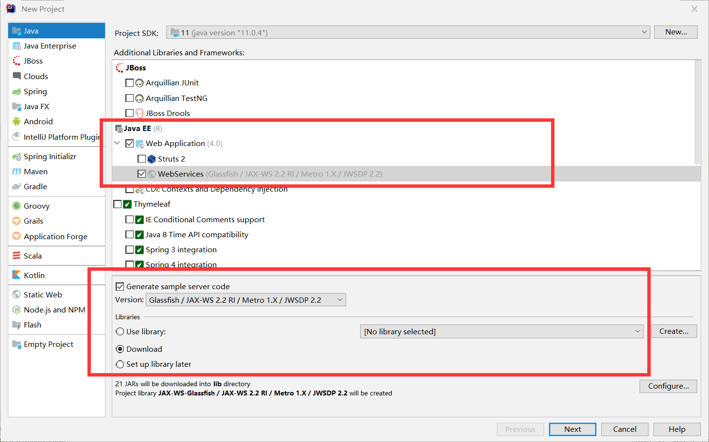


第二步 项目大概

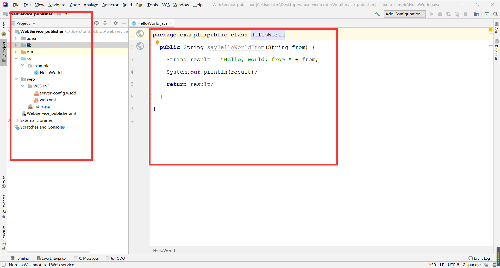


第三步 --有关的jar包 

**javax-annotion-1.2 .jar 好像尤其重要** ,会报错的，

> Caused by: java.lang.NoClassDefFoundError: javax/activation/DataSource


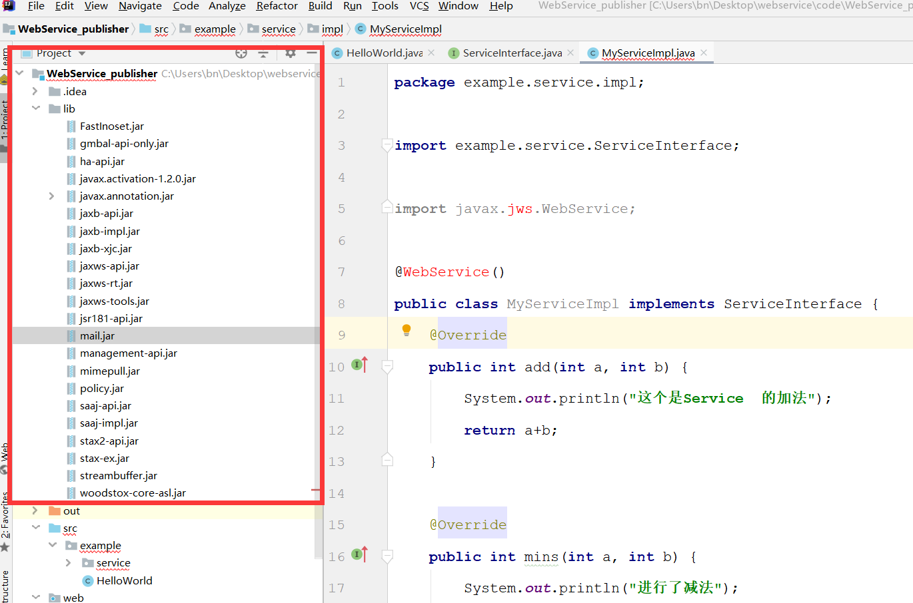


第四步--关于 idea 添加jar 包

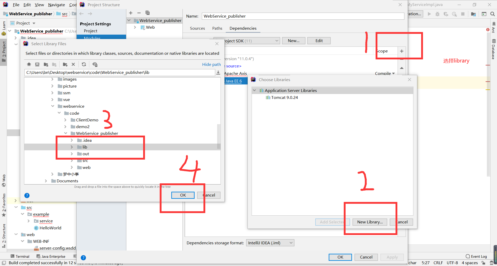


第五步 --点击add selected ，就添加了

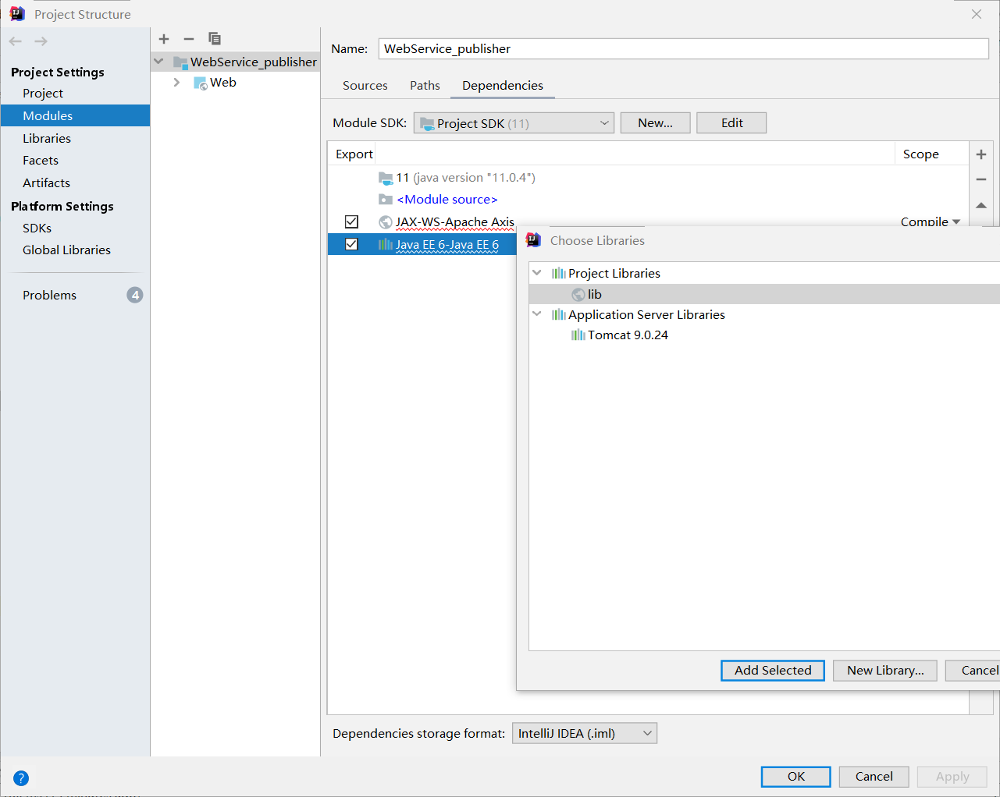


第六步--创建如此目录的文件

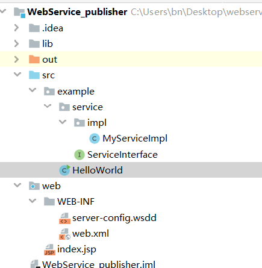


ServiceInterface.java

~~~java
package example.service;

/**
 * 这个是负责想歪暴露的接口
 *
 */
public interface ServiceInterface {
    int add(int a, int b);
    int mins(int a, int b);
}

~~~

MyServiceImpl.java

~~~java
package example.service.impl;

import example.service.ServiceInterface;

import javax.jws.WebService;

/**
 * 这个是 服务的实体类 ，具体服务的逻辑代码写在这里
 */
@WebService()
public class MyServiceImpl implements ServiceInterface {
    @Override
    public int add(int a, int b) {
        System.out.println("这个是Service  的加法");
        return a+b;
    }

    @Override
    public int mins(int a, int b) {
        System.out.println("进行了减法");
        return a-b;
    }
}

~~~

HelloWorld.java

~~~java
package example;

import example.service.impl.MyServiceImpl;

import javax.xml.ws.Endpoint;

public class HelloWorld {

  public static void main(String[] args) {
    String address = "http://localhost:9000/HelloWorld";
    Endpoint.publish(address, new MyServiceImpl());
  }
}

~~~


第七步--右键点击运行

### 2. 检验服务端是否创建成功

~~~
http://localhost:9000/HelloWorld
~~~

看到如下图所示，就表明 项目创建完毕

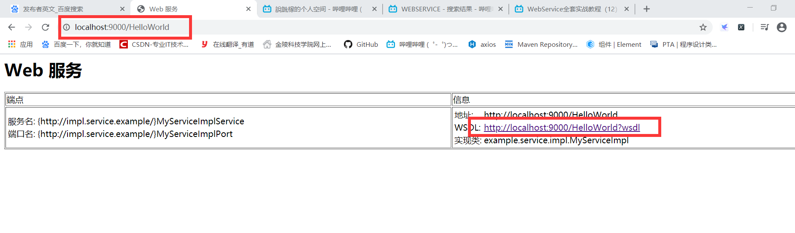

### 3. 创建客服端 -client


第一步，创建项目

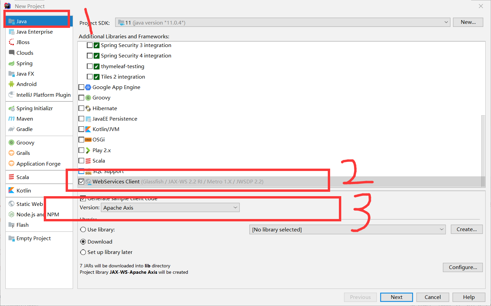


第二部--填写网址

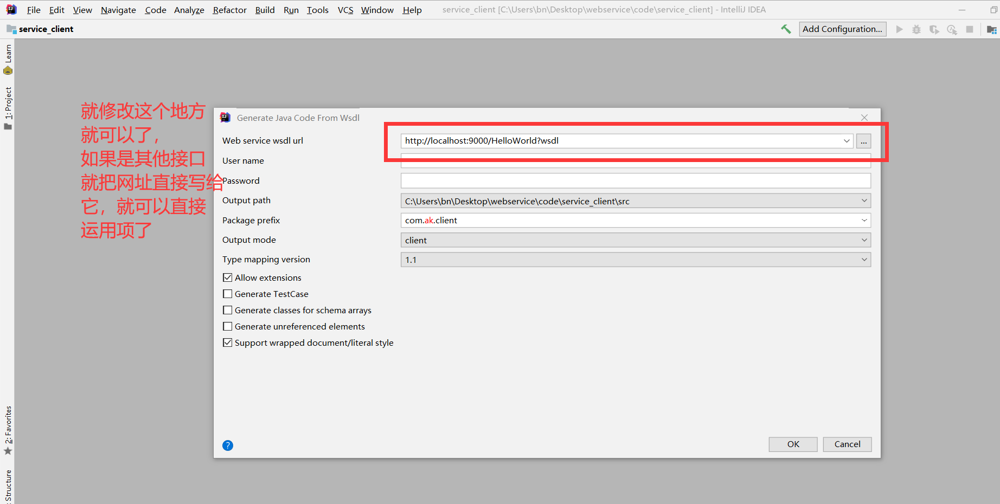


第三步 --修改 HelloWorldClient 内容

~~~java
package example;

import com.ak.client.MyServiceImplServiceLocator;

public class HelloWorldClient {
  public static void main(String[] argv) {
      try {
          MyServiceImplServiceLocator locator = new MyServiceImplServiceLocator();
          int result=locator.getMyServiceImplPort().add(1,2);
          System.out.println(result);
      } catch (javax.xml.rpc.ServiceException ex) {
          ex.printStackTrace();
      } catch (java.rmi.RemoteException ex) {
          ex.printStackTrace();
      }  
  }
}

~~~


第四步--右键运行


### 4. 选择服务

到此入门结束，如果不想要自己创建的webservice 的话，那就可以选择别人的客户端

~~~
http://www.webxml.com.cn/zh_cn/index.aspx
~~~


### 5. WSDL 解释

~~~xml
This XML file does not appear to have any style information associated with it. The document tree is shown below.
<!-- Published by JAX-WS RI at http://jax-ws.dev.java.net. RI's version is JAX-WS RI 2.2.7-b01  svn-revision#${svn.Last.Changed.Rev}. -->
<!-- Generated by JAX-WS RI at http://jax-ws.dev.java.net. RI's version is JAX-WS RI 2.2.7-b01  svn-revision#${svn.Last.Changed.Rev}. -->
<definitions xmlns:wsu="http://docs.oasis-open.org/wss/2004/01/oasis-200401-wss-wssecurity-utility-1.0.xsd" xmlns:wsp="http://www.w3.org/ns/ws-policy" xmlns:wsp1_2="http://schemas.xmlsoap.org/ws/2004/09/policy" xmlns:wsam="http://www.w3.org/2007/05/addressing/metadata" xmlns:soap="http://schemas.xmlsoap.org/wsdl/soap/" xmlns:tns="http://impl.service.example/" xmlns:xsd="http://www.w3.org/2001/XMLSchema" xmlns="http://schemas.xmlsoap.org/wsdl/" targetNamespace="http://impl.service.example/" name="MyServiceImplService">
	<!-- definitions 报文的根结点 -->
	<types>
		<!-- types 表示 webservice 使用的数据类型 -->
		<schema>
			<!-- namespace 表示 命令空间 ，和包名相反 -->
			<!-- element 元素 -->
			<!-- name 表示名称 ，别名 -->
			<!-- schemaLocation 这个网址展示的 方法 的参数问题 -->
			<import namespace="http://impl.service.example/" schemaLocation="http://localhost:9000/HelloWorld?xsd=1" />
		</schema>
	</types>
	<!-- message 表示 请求的方法 -->
	<!-- 定义可以调用的方法-->
	<message name="add">
		<part name="parameters" element="tns:add" />
	</message>
	<message name="addResponse">
		<part name="parameters" element="tns:addResponse" />
	</message>
	<message name="mins">
		<part name="parameters" element="tns:mins" />
	</message>
	<message name="minsResponse">
		<part name="parameters" element="tns:minsResponse" />
	</message>
	<!-- portType 端口类型 ，定义接口 -->
	<portType name="MyServiceImpl">
		<operation name="add">
			<!-- operation 方法名 -->
			<!-- input 表示方法的输入参数 -->
			<!-- message 表示上面指定的 message -->
			<!-- output 表示方法的返回值 -->
			<input wsam:Action="http://impl.service.example/MyServiceImpl/addRequest" message="tns:add" />
			<output wsam:Action="http://impl.service.example/MyServiceImpl/addResponse" message="tns:addResponse" />
		</operation>
		<operation name="mins">
			<input wsam:Action="http://impl.service.example/MyServiceImpl/minsRequest" message="tns:mins" />
			<output wsam:Action="http://impl.service.example/MyServiceImpl/minsResponse" message="tns:minsResponse" />
		</operation>
	</portType>
	<!-- binding 绑定 特定端口类型的集体协议和数据格式化规范的绑定，定义接口的实现 -->
	<binding name="MyServiceImplPortBinding" type="tns:MyServiceImpl">
		<!-- type 表示和那个 portType 关联 -->
		<binding transport="http://schemas.xmlsoap.org/soap/http" style="document" />
		<operation name="add">
			<operation soapAction="" />
			<input>
				<body use="literal" />
			</input>
			<output>
				<body use="literal" />
			</output>
		</operation>
		<operation name="mins">
			<operation soapAction="" />
			<input>
				<body use="literal" />
			</input>
			<output>
				<body use="literal" />
			</output>
		</operation>
	</binding>
	<!-- service 表示服务访问点的集合 -->
	<!-- name 指定客户端生成的 类名 -->
	<service name="MyServiceImplService">

	<!-- binding 表示上面的binding对象  -->
	<!-- name 标识名称 ，在service 类中有一个对应的 get() 方法，可以获取到代理的对象 -->
		<port name="MyServiceImplPort" binding="tns:MyServiceImplPortBinding">
			<!-- address 指定webservice的地址 -->
			<address location="http://localhost:9000/HelloWorld" />
		</port>
	</service>
</definitions>

~~~


### 6. 注解解释

##### @WebParam

> 作用：
>
> 修改报文中参数的信息
>
> 发布之后，查看wsdl文档中的schemLocation的地址


首先我们来看一下不用 webparam 注解的时候参数的变化

~~~java
    @Override
    public int add(int a, int b) {
        System.out.println("这个是Service  的加法");
        return a+b;
    }
~~~

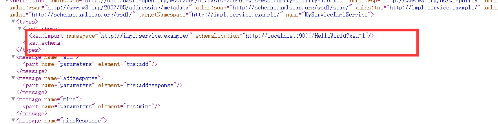


看见 schemaLocation 的位置 ，然后打开这个网址即可

> http://localhost:9000/HelloWorld?xsd=1

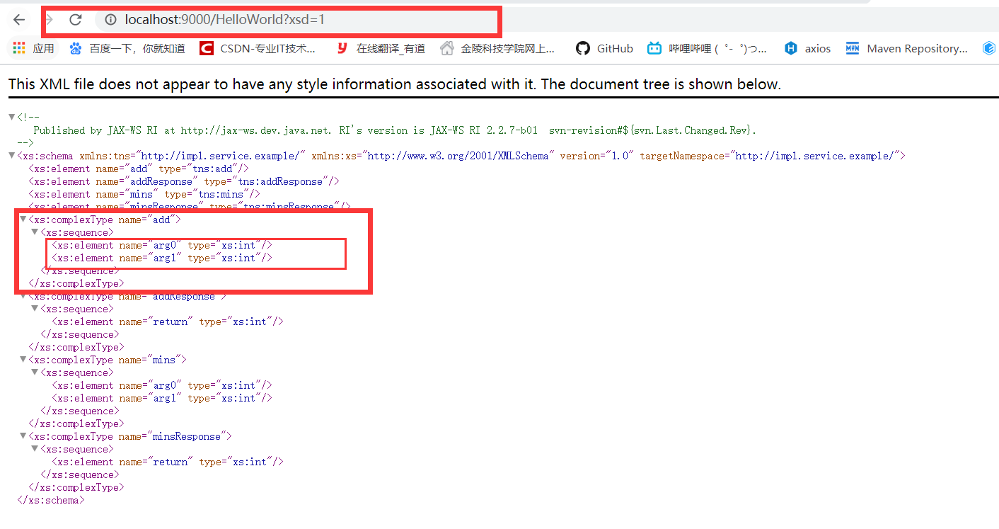


然后进行一下修改

~~~java
package example.service.impl;

import example.service.ServiceInterface;

import javax.jws.WebParam;
import javax.jws.WebService;

/**
 * 这个是 服务的实体类 ，具体服务的逻辑代码写在这里
 */
@WebService()
public class MyServiceImpl implements ServiceInterface {


    /**
     * 这里 WebParam 中 name 属性不要取 名相同的字符比如,arg0,arg1,arg2,
     * 因为会和默认的参数名有冲突，会报错，
     * Duplicate field name "arg1" with signature "I" in class file
     * 不要紧，修改一下 name 即可
     * @param a
     * @param b
     * @return
     */
    @Override
    public int add(@WebParam(name="a_1") int a, int b) {
        System.out.println("这个是Service  的加法");
        return a+b;
    }

    @Override
    public int mins(int a, int b) {
        System.out.println("进行了减法");
        return a-b;
    }
}

~~~

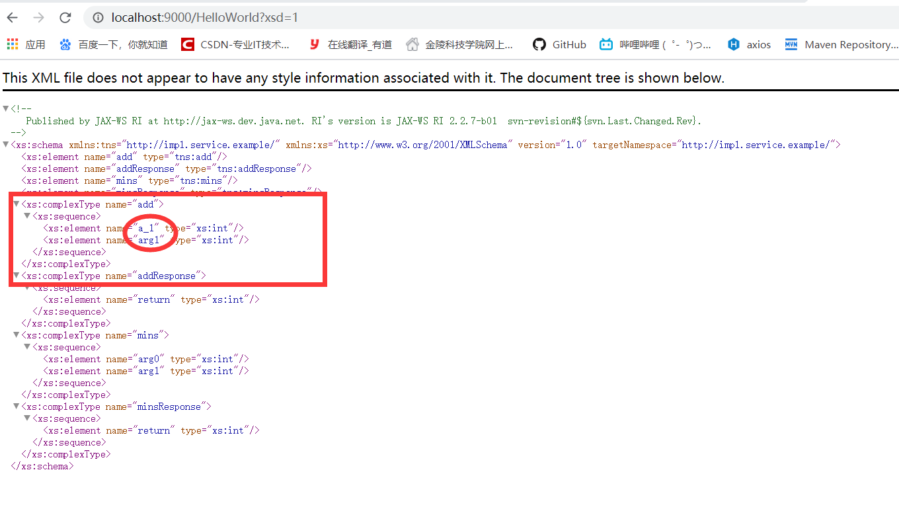


发现参数名已经变了，如果不加 webparam 的 话，参数名就是默认的 arg0,arg1,arg2


##### @WebResult

>  作用：
>
> 修改返回值的名字

修改前

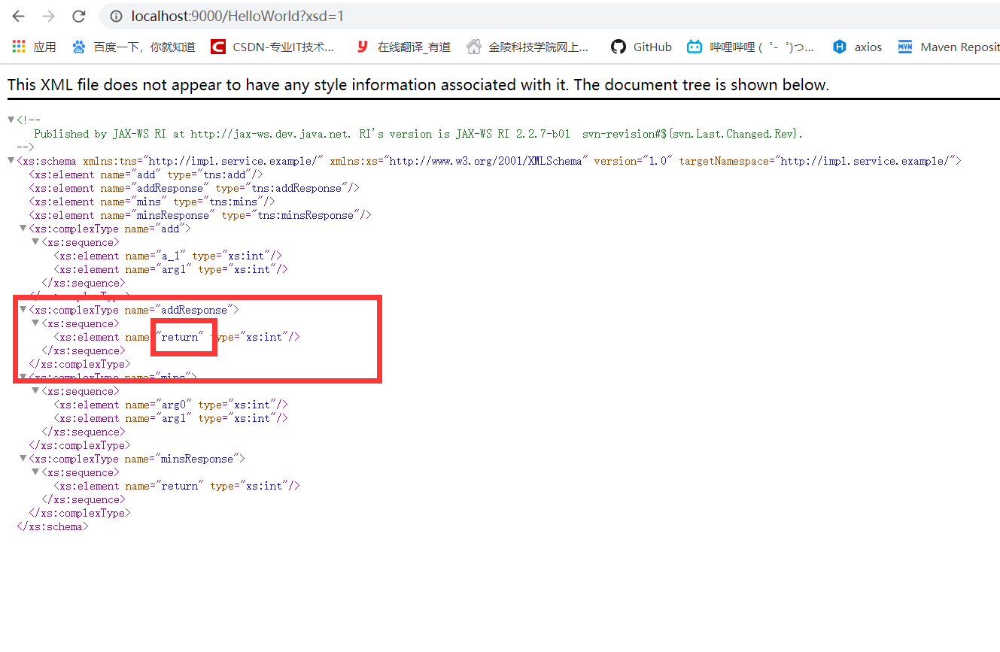

修改后

~~~
 @WebResult(name = "self_return")
    @Override
    public int add(int a, int b) {
        System.out.println("这个是Service  的加法");
        return a+b;
    }
~~~

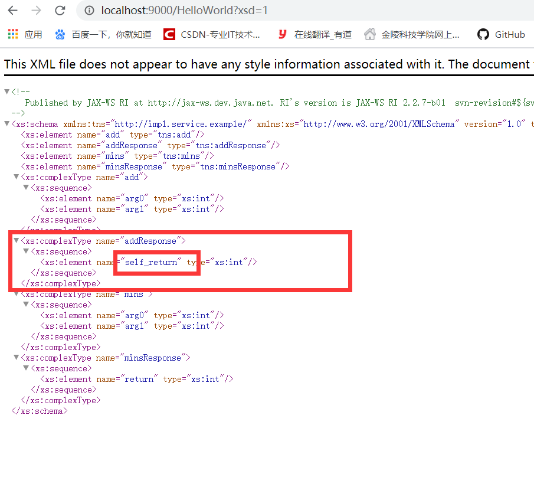

##### @WebMethod

> 作用:
>
> 该注解用于用@WebService注解的类或接口的方法上，表示要发布的方法。发布的函数是该类中的所有public方法且非static的。

有两个用途

* 修改方法名
* 设置方法的可见性

原本的的代码

~~~
package example.service.impl;

import example.service.ServiceInterface;

import javax.jws.WebParam;
import javax.jws.WebResult;
import javax.jws.WebService;

/**
 * 这个是 服务的实体类 ，具体服务的逻辑代码写在这里
 */
@WebService()
public class MyServiceImpl implements ServiceInterface {

    
    @Override
    public int add(int a, int b) {
        System.out.println("这个是Service  的加法");
        return a+b;
    }

    @Override
    public int mins(int a, int b) {
        System.out.println("进行了减法");
        return a-b;
    }
}

~~~

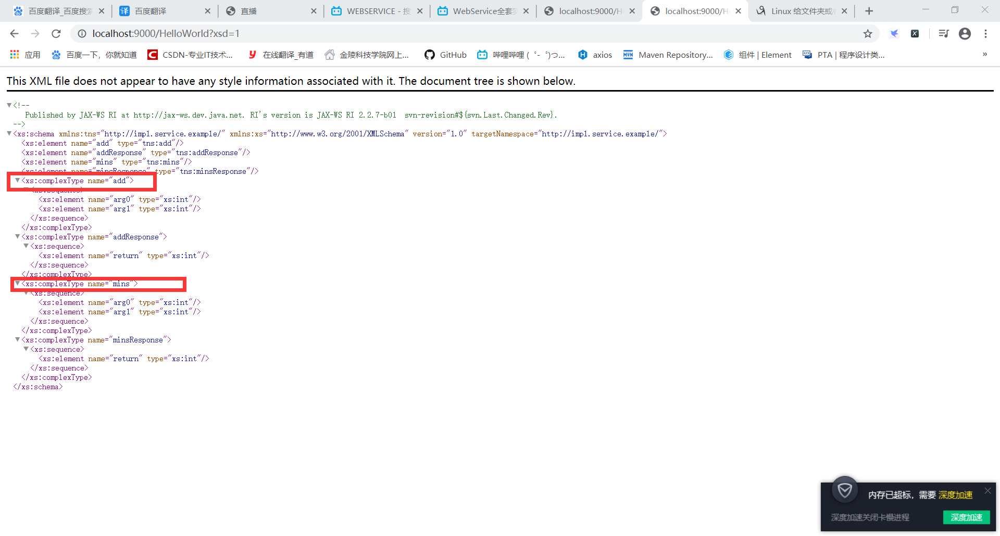

修改后的代码

~~~java
package example.service.impl;

import example.service.ServiceInterface;

import javax.jws.WebMethod;
import javax.jws.WebParam;
import javax.jws.WebResult;
import javax.jws.WebService;
import javax.xml.ws.spi.WebServiceFeatureAnnotation;

/**
 * 这个是 服务的实体类 ，具体服务的逻辑代码写在这里
 */
@WebService()
public class MyServiceImpl implements ServiceInterface {


    /**
     * 设置报文中的方法的名字
     * @param a
     * @param b
     * @return
     */
    @WebMethod(operationName = "self_add")
    @Override
    public int add(int a, int b) {
        System.out.println("这个是Service  的加法");
        return a+b;
    }

    /**
     * 设置 不可见
     * @param a
     * @param b
     * @return
     */
    @WebMethod(exclude = true)
    @Override
    public int mins(int a, int b) {
        System.out.println("进行了减法");
        return a-b;
    }
}

~~~

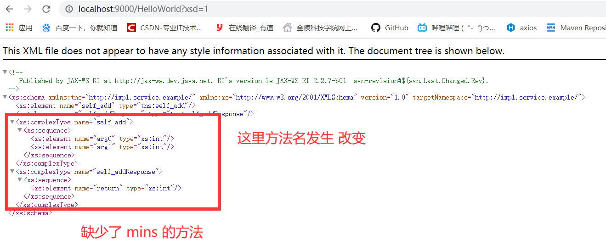

##### @WebService

> 作用
>
>  该注解用于对接口，类进行注解，表示要发布的web服务。

属性的讲解

* serviceName： 对外发布的服务名，指定 Web Service 的服务名称：wsdl:service。缺省值为 Java 类的简单名称 + Service。（字符串）

* endpointInterface： 服务接口全路径, 指定做SEI（Service EndPoint Interface）服务端点接口

* name：此属性的值包含XML Web Service的名称。在默认情况下，该值是实现XML Web Service的类的名称，wsdl:portType 的名称。缺省值为 Java 类或接口的非限定名称。（字符串

* portName：  wsdl:portName。缺省值为 WebService.name+Port。

* targetNamespace：指定你想要的名称空间，认是使用接口实现类的包名的反缀

* wsdlLocation：指定用于定义 Web Service 的 WSDL 文档的 Web 地址。Web 地址可以是相对路径或绝对路径。（字符串）

修改前

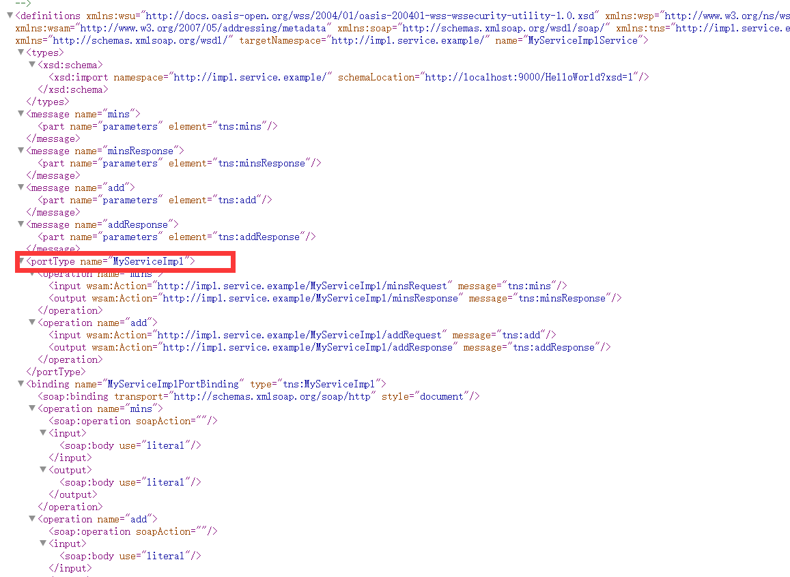

修改后

这里为了全部展示，去掉了min 的方法

~~~
package example.service.impl;

        import example.service.ServiceInterface;

        import javax.jws.WebMethod;
        import javax.jws.WebParam;
        import javax.jws.WebResult;
        import javax.jws.WebService;
        import javax.xml.ws.spi.WebServiceFeatureAnnotation;

/**
 * 这个是 服务的实体类 ，具体服务的逻辑代码写在这里
 */
@WebService(name = "My_Self",portName = "My_Port_Name",serviceName = "my_Service_Name")
public class MyServiceImpl implements ServiceInterface {


    @Override
    public int add(int a, int b) {
        System.out.println("这个是Service  的加法");
        return a+b;
    }


    @WebMethod(exclude = true)
    @Override
    public int mins(int a, int b) {
        System.out.println("进行了减法");
        return a-b;
    }
}

~~~

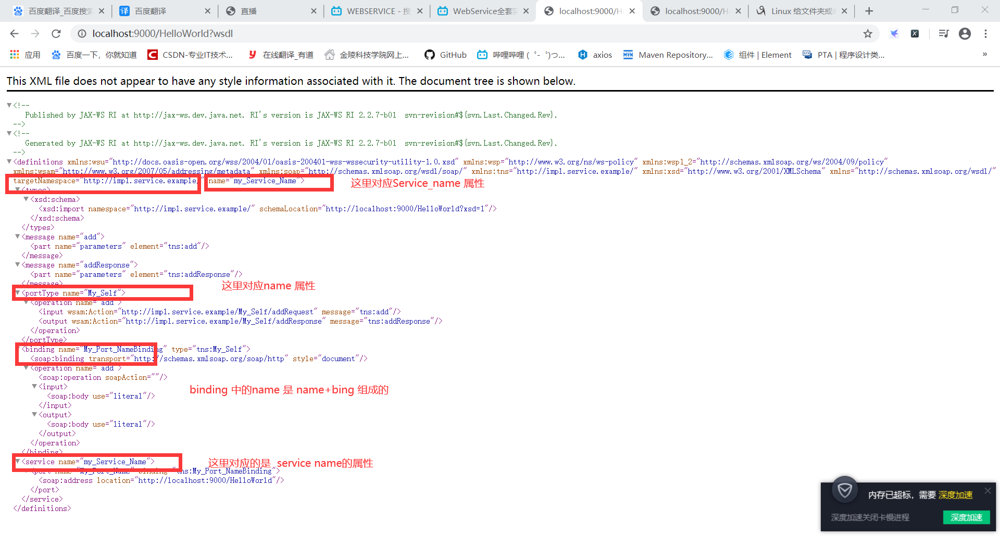


### 7. SOAP

教程地址

~~~
https://www.runoob.com/soap/soap-tutorial.html
~~~

每次创建客户端都太麻烦了，所以我们直接模拟出 SOAP 格式的数据，这样子，每次webservice 进行更新，就没有必要重新生成客户端代码了,

首先创建的 第一步，就是需要知道格式长什么样？就需要 监视器了

>  eclipse    tcp/ip monitor
>
> https://blog.csdn.net/wei_chong_chong/article/details/47656661

> idea TunnelliJ(推荐) Axis Tcp monitor 
>
> https://plugins.jetbrains.com/
>
> settings- plugins---install from disk
>
> 重启


SOAP 基本内容

头

~~~
POST /cxf_server HTTP/1.1
Content-Type: text/xml; charset=UTF-8
Accept:
*/*
SOAPAction: ""
User-Agent: Apache-CXF/3.3.1
Cache-Control: no-cache
Pragma: no-cache
Host: localhost:8088
Connection: keep-alive
Content-Length: 189
~~~

主题内容

~~~xml
<?xml version="1.0"?>
<soap:Envelope
xmlns:soap="http://www.w3.org/2001/12/soap-envelope"
soap:encodingStyle="http://www.w3.org/2001/12/soap-encoding">
 
<soap:Header>
  ...
  ...
</soap:Header>
 
<soap:Body>
  ...
  ...
  <soap:Fault>
    ...
    ...
  </soap:Fault>
</soap:Body>
 
</soap:Envelope>
~~~

#### 元素

一条 SOAP 消息就是一个普通的 XML 文档，包含下列元素：

* 必需的 Envelope 元素，可把此 XML 文档标识为一条 SOAP 消息

* 可选的 Header 元素，包含头部信息

* 必需的 Body 元素，包含所有的调用和响应信息

* 可选的 Fault 元素，提供有关在处理此消息所发生错误的信息

#### 模拟发送

~~~java
import java.io.ByteArrayOutputStream;
import java.io.InputStream;
import java.net.HttpURLConnection;
import java.net.URL;

/**
 * 发送自己的soap
 *
 */
public class MyClient2 {

	
	public static void main(String[] args) throws Exception {
		URL url = new URL("http://localhost:8080/hello?wsdl");
		HttpURLConnection connection = (HttpURLConnection) url.openConnection();
		connection.setRequestMethod("POST");
		connection.setRequestProperty("Content-Type","text/xml");
		connection.setDoOutput(true);
		String str = outStr("zhangsan");
		connection.getOutputStream().write(str.getBytes());
		connection.connect();
		int responseCode = connection.getResponseCode();
		if(responseCode==200) {
			InputStream inputStream = connection.getInputStream();
			ByteArrayOutputStream baos = new ByteArrayOutputStream();
			byte[] bytes = new byte[1024];
			int len = 0;
			while((len=inputStream.read(bytes))!= -1) {
				baos.write(bytes);
			}
			System.out.println(baos.toString());
			baos.close();
			inputStream.close();
		}else {
			System.out.println("请求失败");
		}
		
	}
	
	private static  String outStr(String username) {
		String str = "<S:Envelope xmlns:S=\"http://schemas.xmlsoap.org/soap/envelope/\">" + 
				"	<S:Body>" + 
				"		<ns2:sayHello xmlns:ns2=\"http://ws.niit.com/\">" + 
				"			<arg0>"+username+"</arg0>" + 
				"		</ns2:sayHello>" + 
				"	</S:Body>" + 
				"</S:Envelope>";
		return str;
	}
	

	
}
~~~


### 8. 实践-实现中英文翻译

首先选择自己 的 webservice

~~~
http://fy.webxml.com.cn/webservices/EnglishChinese.asmx?wsdl
~~~

* 按照步骤三 创建客户端服务-client 来完成

* 如果web 项目 已经创建完毕了，就可以按照如下不中欧进行添加

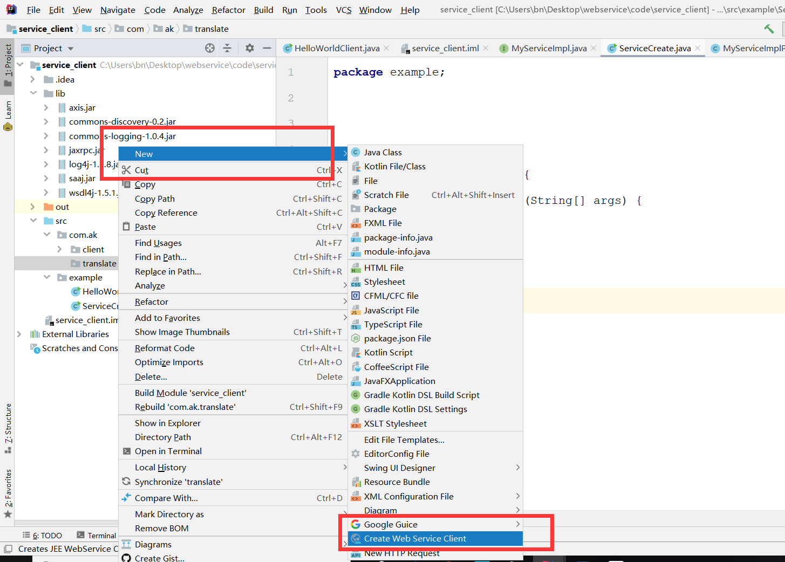


* **注意点 没有 create web Service Client 这个选项**  就选择添加模块

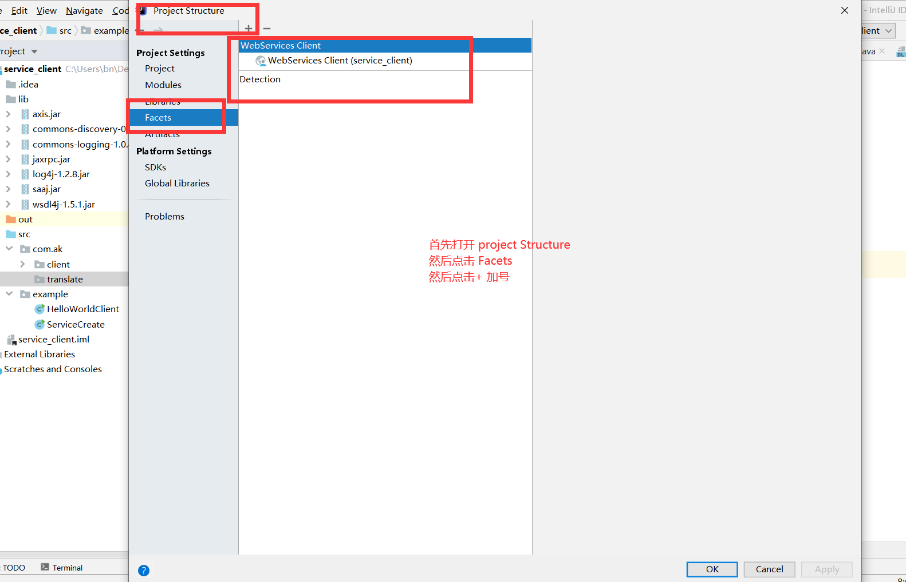


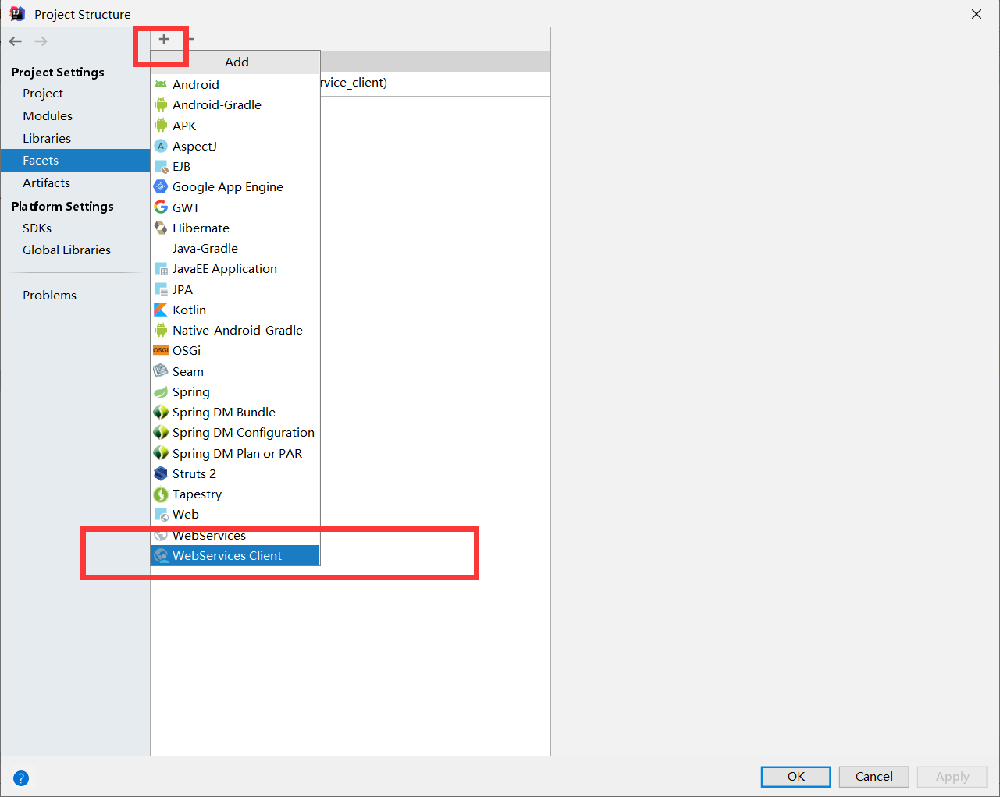

* 然后 重新点击 New ,就会有了，然后 按照图片创建 项目，输入上面的网址

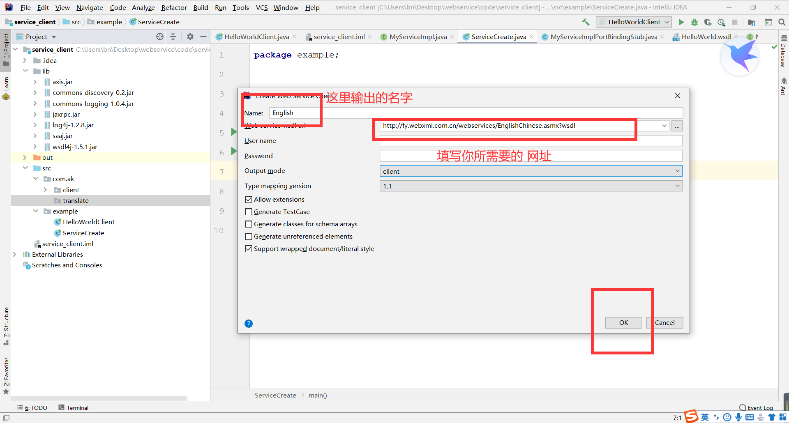


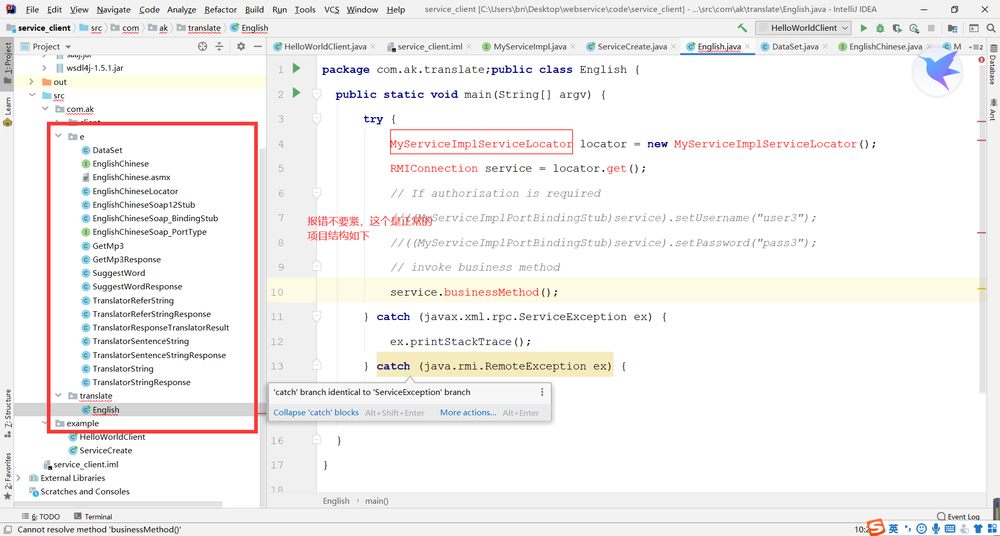

* 修改 English 中的内容

~~~java
package com.ak.translate;

import com.ak.e.EnglishChineseLocator;
public class English {
    public static void main(String[] argv) {
        try {

            EnglishChineseLocator locator = new EnglishChineseLocator();
            String p[] = locator.getEnglishChineseSoap().translatorString("中国");
            for (String item : p) {
                System.out.println(item);
            }
        } catch (javax.xml.rpc.ServiceException ex) {
            ex.printStackTrace();
        } catch (java.rmi.RemoteException ex) {
            ex.printStackTrace();
        }
    }
}

~~~

* 右键点击运行

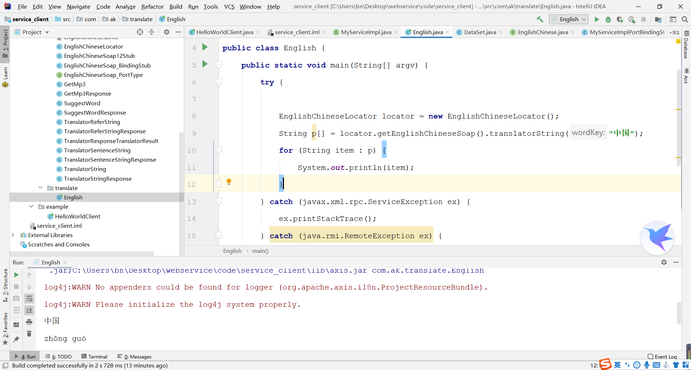

## 3.2 DTD 和 Schema

### 1. XML 讲解

#### 学习网址

~~~
https://www.w3school.com.cn/xml/xml_syntax.asp
~~~
#### 什么是xml

- XML 指可扩展标记语言（Extensible *M*arkup *L*anguage）
- XML 是一种*标记语言*，很类似 HTML
- XML 的设计宗旨是*传输数据*，而非显示数据
- XML 标签没有被预定义。您需要*自行定义标签*。
- XML 被设计为具有*自我描述性*。
- XML 是 W3C 的推荐标准

#### xml 和 html 之间的差异

> xml 是被设计用来存储 和传输数据的
>
> html 是被设计用来展示数据的

样例

~~~xml
<bookstore>
<book category="COOKING">
  <title lang="en">Everyday Italian</title> 
  <author>Giada De Laurentiis</author> 
  <year>2005</year> 
  <price>30.00</price> 
</book>
<book category="CHILDREN">
  <title lang="en">Harry Potter</title> 
  <author>J K. Rowling</author> 
  <year>2005</year> 
  <price>29.99</price> 
</book>
<book category="WEB">
  <title lang="en">Learning XML</title> 
  <author>Erik T. Ray</author> 
  <year>2003</year> 
  <price>39.95</price> 
</book>
</bookstore>
~~~

解释

其中 根元素为 <bookstore> ，然后呢有子元素

<book> ,<book> 都有一个必填的属性的category

,然后 <book> 四个子元素<title>,<author>,<year>,<price>

#### xml 中的转义字符

**符号都是以&开始的，; 结尾的**

| 符号       | 转义字符串 |
| ---------- | ---------- |
| < 小于号   | \&lt;      |
| > 大于号   | \&gt;      |
| & and 符号 | \&amp;     |
| " 双引号   | \&quot;    |
| ' 单引号   | \&apos;    |

#### CDATA特殊标签

格式: <! [ CDATA  [ 文本内容 ] ] >

作用: 表示标签中的实体应用都会被忽略，被当做一个整体

#### 属性

1) 格式：属性="属性值" 

2) 要求： 

​	属性必须有值 

​	属性值必须用引号引起来，单引号或双引号都可以，但必须一致

#### xml 的注释

<!-- 这是一段注释 --> 

#### xml 的语法规则

* xml 必须要有关闭的标签
* xml 标签对于大小写很敏感
* xml 必须正确的嵌套
* xml 必须要有根元素
* xml 属性值必须要加 引号
* xml 中的空格会保留

### 2. 文档类型定义 DTD

#### DTD 的含义.

文档类型定义 DTD（Document Type Difinition）

DTD 和Schema 都是用来 规范 XML  的标记 规则

行业交换数据时要求xml文件格式相同，所以需要大家遵守规范的xml文件格式，比如两个xml 文件要有相同的元素嵌套关系、相同的属性定义，相同的元素顺序，元素出现相同的次数等。

1. DTD文档用来定义XML文件的格式，约束XML文件中的标记规则 

2. DTD类型 

   1）PUBLIC（行业共用的）

   2）SYSTEM（小范围自定义的）

应用方式

~~~xml
<!DOCTYPE students PUBLIC "//UNKNOWN/" "unknown.dtd">
~~~

#### 规则讲解

方法

* 第一步 列举出出现的 子标签，及放数据的标签
  子标签里面 没有其他标签了 ，只有数据，可以直接放(#PCDATA)
* 第二步 列举出所有的嵌套关系，是不放数据的标签 
* 第三步 列举出所有的属性


| 符号     | 作用                                                         | 样例                                                         |
| -------- | ------------------------------------------------------------ | ------------------------------------------------------------ |
| +        | 表示这个标签可以穿线 1-n次，意思为必须出现一次               | <!ELEMENT students (student)*> 表示 students 这个标签可以出现 0-n 次，并不是 student 标签<br><!ELEMENT students (student*)> 表示 student 这个标签可以出现很多次 |
| *        | 表示这个标签可以出现0-n次，表示这个标签可以不出现，也可以出现n 次 | <!ELEMENT student (stuname+,stuage?,phone*,course*)> 表示 course 标签可以出现很多次 |
| ？       | 表示这个标签只可以出现 0 或者1 次，要么出现，要么不出现      | <!ELEMENT student (stuname+,stuage?,phone*,course*)> 表示stuage 标签只能出现 0或者 1 |
| \|       | 用在括号里面()，表示()括号的标签只能出现一次                 | <!ELEMENT student (stuname+ \| stuage)> 表示 student 下面的嵌套标签 stuname 和stuage 只能二选一 |
| ()       | 表示这个标签里面可以嵌套什么标签，或者数据                   | <!ELEMENT students (student)*> 表示 students 标签里面可以嵌套 student 这个标签 |
| #PCDATA  | 表示 字符串                                                  | <!ELEMENT course (#PCDATA)> 表示course 这个标签里面只能放数据 |
| 啥都不加 | 表示必须出现也只能出现一次                                   |                                                              |


~~~xml
<?xml version="1.0" encoding="UTF-8"?>
<!-- 这里标签表示 这个文档为xml 格式-->
<!--!DOCTYPE 表示的是 DTD 文档格式的内容-->
<!-- students 表示根节点 [] 里面放入的规则-->
<!-- #PCDATA 表示的是 字符串-->

<!-- 步骤 -->
<!--第一步 列举出出现的 子标签，及放数据的标签 -->
<!--子标签里面 没有其他标签了 ，只有数据，可以直接放(#PCDATA)-->
<!--第二步 列举出所有的嵌套关系，是不放数据的标签  -->
<!--第三步 列举出所有的属性-->

<!DOCTYPE students[

<!ELEMENT stuname (#PCDATA)>
<!ELEMENT stuage (#PCDATA)>
<!ELEMENT phone (#PCDATA)>
<!ELEMENT course (#PCDATA)>

<!ELEMENT students (student)*>
<!ELEMENT student (stuname+,stuage+,phone*,course*)>
<!ATTLIST student id CDATA #REQUIRED>
        ]>
<students >

    <student id="1">
        <stuname >zhangsan</stuname>
        <stuage>11</stuage>
        <phone>150XXXX1235</phone>
        <course>语文</course>
        <course>数学</course>
    </student>

    <student id="2">
        <stuname>lilei</stuname>
        <phone>150XXXX1234</phone>
    </student>

    <student id="3">
        <stuname>lisi</stuname>
        <stuage>20</stuage>
        <phone>15121976526</phone>
    </student>

</students>


~~~

#### 属性讲解

格式如下

```
<!ATTLIST 标签名字   属性名字     属性类型>
```
样例如下
```xml
<!ATTLIST student    id        CDATA #REQUIRED>
```

| 样例               | 作用                                                         |
| ------------------ | ------------------------------------------------------------ |
| id CDATA #REQUIRED | 表示 id 这个属性为必须的                                     |
| id CDATA #IMPLIED  | 表示 id 这个属性不是必须的                                   |
| id CDATA "false"   | 表示 di 这个属性默认值为false,如果定义了hot的属性，就取定义的值 |

**常见错误**

| 错误                   | 样例                                                         |
| ---------------------- | ------------------------------------------------------------ |
| 标签名和()之间缺少空格 | <!ELEMENT phone(#PCDATA)>和<br><!ELEMENT phone (#PCDATA)>    |
| 全角的逗号             | 中文的，和英文的,                                            |
| 标签出现的顺序         | <!ELEMENT student (stuname+,stuage+,phone*,course*)>和<br><!ELEMENT student (stuage+,stuname+,phone*,course*)> |

### Schema

学习教程

~~~
https://www.w3school.com.cn/schema/index.asp
~~~


出现理由：为了解决 DTD 命名冲突

schema 的文件扩展名xsd

schema 的名词：

* 简单元素(叶子元素)
* 复杂元素(有子元素的元素)

#### 简单元素

~~~
<xs:element name="xxx" type="yyy"/>
~~~

name 表示元素的名称，type 表示 数据类型

 最常用的类型是：

- xs:string
- xs:decimal
- xs:integer
- xs:boolean
- xs:date
- xs:time

#### 属性

~~~xml
<xs:attribute name="xxx" type="yyy"/>
~~~

在此处，xxx 指属性名称，yyy 则规定属性的数据类型。

```xml
<lastname lang="EN">Smith</lastname>
```

~~~xml
<xs:attribute name="lang" type="xs:string"/>
~~~


#### 复杂元素

~~~xml
<employee>
   <firstname>John</firstname>
   <lastname>Smith</lastname>
</employee>
~~~

对应如下xsd

~~~xml
<xs:element name="employee">
  <xs:complexType>
    <xs:sequence>
      <xs:element name="firstname" type="xs:string"/>
      <xs:element name="lastname" type="xs:string"/>
    </xs:sequence>
  </xs:complexType>
</xs:element>
~~~


我们之前上面举例

dtd

~~~
<!DOCTYPE students[

<!ELEMENT stuname (#PCDATA)>
<!ELEMENT stuage (#PCDATA)>
<!ELEMENT phone (#PCDATA)>
<!ELEMENT course (#PCDATA)>

<!ELEMENT students (student)*>
<!ELEMENT student (stuname+,stuage+,phone*,course*)>
<!ATTLIST student id CDATA #REQUIRED>
        ]>
~~~

schema

~~~xml
<?xml version="1.0"?>
<xs:schema xmlns:xs="http://www.w3.org/2001/XMLSchema"
           targetNamespace="http://www.w3school.com.cn"
           xmlns="http://www.w3school.com.cn"
           elementFormDefault="qualified">

    <xs:element name="students">
        <xs:complexType>
<!--            xs:sequence 表示 标签必须按照如下 顺序出现-->
            <xs:sequence>
<!--                表示有 student 这个元素  maxOccurs="unbounded" 不限制个数-->
                <xs:element name="student" maxOccurs="unbounded" minOccurs="0">
<!--                    表示这个是复杂的属性-->
                    <xs:complexType>
<!--                  all 表示按照任意顺序出现 -->
                        <xs:sequence>
<!--                            minOccurs="1" 不设置 的话 ，默认为 1-->
<!--                      minOccurs 最少出现次数     -->
<!--                            表示必须出现 ，并且只能出现一次-->
                            <xs:element name="stuname" type="xs:string" />
<!--                      maxOccurs   表示？ 出现 0 或者 1   -->
                            <xs:element name="stuage" type="xs:integer" minOccurs="0"/>
                       
                            <xs:element name="phone" type="xs:string"  />
<!--                            表示上无线 ，0 -n 次 -->
                            <xs:element name="course" type="xs:string" maxOccurs="unbounded" minOccurs="0"/>
                        </xs:sequence>
                        <!--            表示 student 标签有 id 这个属性-->
                        <xs:attribute name="id" type="xs:string" use="required"/>
                    </xs:complexType>
                </xs:element>
            </xs:sequence>
        </xs:complexType>
    </xs:element>


</xs:schema>
~~~

xml

~~~xml
<?xml version="1.0" encoding="UTF-8"?>

<students
        xmlns="http://www.w3school.com.cn"
        xmlns:xsi="http://www.w3.org/2001/XMLSchema-instance"

        xsi:schemaLocation="http://www.w3school.com.cn 2.xsd">
    <!-- 这里是应用xml 的地方      -->
    <student id="1">
        <stuname >zhangsan</stuname>
        <stuage>11</stuage>
        <phone>150XXXX1235</phone>
        <course>语文</course>
        <course>数学</course>
    </student>

    <student id="2">
        <stuname>lilei</stuname>
        <phone>150XXXX1234</phone>
    </student>

    <student id="3">
        <stuname>lisi</stuname>
        <stuage>20</stuage>
        <phone>15121976526</phone>
    </student>

</students>


~~~

在线schema 编译器

~~~
https://www.freeformatter.com/
~~~


## 3.3 JAXP


### 1. 含义


Java API for XMLProcessing

java解析和处理xml，方式有：dom,sax,dom4j等。


###  2. 三种解析方式比较

* DOM（Document Object Model 文档对象模型）

  关键字：树(Document) 

  优点： 把xml文件在内存中构造树形结构，可以遍历和修改节点 

  缺点： 如果文件比较大，内存有压力，解析的时间会比较长

* SAX（Simple API for Xml 基于XML的简单API）

  关键字：流(Stream) 把xml文件作为输入流，触发标记开始，内容开始，标记结束等动作

  优点： 解析可以立即开始，速度快，没有内存压力 

  缺点： 不能对节点做修改 

* JDOM / DOM4J ：目前市场上常用的2种解析XML文件的API。dom4J 是一个优秀	的Java XML API，将整个文档读入，然后解析，具有性能优异、功能强大和极端易用使	用的特点，同时它也是一个开放源代码的软件。

DOM4j 集合了 DOM 和 SAX 两种解析方式优点

### 3. Dom4j

dom4j 常用的对象

| 名称      | 作用                                       |
| --------- | ------------------------------------------ |
| SAXReader | 读取xml文件到Document树结构文件对象        |
| Document  | 是一个xml文档对象树，类比html文档对象      |
| Element   | 元素节点，通过Document对象可以查找单个元素 |


* 创建一个maven 工程

~~~xml
<?xml version="1.0" encoding="UTF-8"?>
<project xmlns="http://maven.apache.org/POM/4.0.0"
         xmlns:xsi="http://www.w3.org/2001/XMLSchema-instance"
         xsi:schemaLocation="http://maven.apache.org/POM/4.0.0 http://maven.apache.org/xsd/maven-4.0.0.xsd">
    <modelVersion>4.0.0</modelVersion>

    <groupId>com.ak</groupId>
    <artifactId>joker</artifactId>
    <version>1.0-SNAPSHOT</version>

    <dependencies>

        <dependency>
            <groupId>dom4j</groupId>
            <artifactId>dom4j</artifactId>
            <version>1.6.1</version>
        </dependency>

        <!-- https://mvnrepository.com/artifact/org.junit.jupiter/junit-jupiter-api -->
        <!-- https://mvnrepository.com/artifact/junit/junit -->
        <dependency>
            <groupId>junit</groupId>
            <artifactId>junit</artifactId>
            <version>4.12</version>
            <scope>test</scope>
        </dependency>
    </dependencies>
</project>
~~~


* 在resource 文件夹下创建 1.xml

~~~xml
<?xml version="1.0" encoding="utf-8"?>
<booklist>
    <book isbn="1001" catalog="武侠">
        <title lang="zh">天龙八部</title>
        <author>金庸</author>·
        <price> 60</price>
        <year> 1965</year>
    </book>
    <book isbn="1002" catalog="武 侠">
        <title lang="zh">天涯明月刀</title>
        <author>古龙</author>
        <price>45</price>
        <year>1969</year>
    </book>
    <book isbn="1003" catalog="科幻">
        <title lang="en">哈 利波特</title>
        <author>Rowling</author>
        <price>86</price>
        <year>2005</year>
    </book>
    <book isbn="1004" catalog="Web">
        <title lang="en">Struts</title>
        <author>Bruce</author>
        <price>90</price>
        <year>2011</year>
    </book>
</booklist>
~~~

* 创建测试类 MyTest

  ~~~java
  //import org.dom4j.Document;
  //import org.dom4j.Element;
  //import org.dom4j.io.SAXReader;
  import org.dom4j.Document;
  import org.dom4j.Element;
  import org.dom4j.io.SAXReader;
  import org.junit.Test;
  
  import java.util.List;
  
  public class MyTest {
      /**
       * 读取
       * @throws Exception
       */
      @Test
      public void testReadXml() throws Exception {
          SAXReader reader = new SAXReader();
          Document doc = reader.read("src/main/resources/1.xml");
          //获取根节点
          Element root = doc.getRootElement();
          //获取根节点下的子元素
          List list = root.elements();
          //迭代
          for(int i = 0;i<list.size();i++) {
              //获取第一个元素<book>
              Element element = (Element) list.get(i);
              //打印book子元素的值
              System.out.println("title="+element.elementText("title"));
              System.out.println("author="+element.elementText("author"));
              System.out.println("price="+element.elementText("price"));
              System.out.println("year"+element.elementText("year"));
              System.out.println("==================");
          }
      }
  }
  
  
  ~~~

* 可能出现error ，不支持发型版本5
~~~
https://www.jianshu.com/p/8ff4652fabd0
~~~

* 项目结构如下

  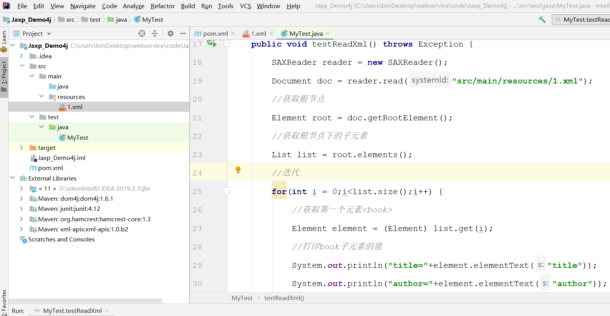

*  测试属性

  ~~~java
  //import org.dom4j.Document;
  //import org.dom4j.Element;
  //import org.dom4j.io.SAXReader;
  import org.dom4j.Attribute;
  import org.dom4j.Document;
  import org.dom4j.Element;
  import org.dom4j.io.SAXReader;
  import org.junit.Test;
  
  import java.util.List;
  
  public class MyTest {
      /**
       * 读取
       * @throws Exception
       */
      @Test
      public void testReadXml() throws Exception {
          SAXReader reader = new SAXReader();
          Document doc = reader.read("src/main/resources/1.xml");
          //获取根节点
          Element root = doc.getRootElement();
          //获取根节点下的子元素
          List list = root.elements();
          //迭代
          for(int i = 0;i<list.size();i++) {
              //获取第一个元素<book>
              Element element = (Element) list.get(i);
              //打印book子元素的值
              System.out.println("title="+element.elementText("title"));
              System.out.println("author="+element.elementText("author"));
              System.out.println("price="+element.elementText("price"));
              System.out.println("year"+element.elementText("year"));
              System.out.println("==================");
          }
      }
  
      /**
       * 读取
       * @throws Exception
       */
      @Test
      public void testReadXml_2() throws Exception {
          SAXReader reader = new SAXReader();
          Document doc = reader.read("src/main/resources/1.xml");
          //获取根节点
          Element root = doc.getRootElement();
          //获取根节点下的子元素
          List list = root.elements();
          //迭代
          for(int i = 0;i<list.size();i++) {
              //获取第一个元素<book>
              Element element = (Element) list.get(i);
              //获取book元素的属性
              List attributes = element.attributes();
              for(int j = 0;j<attributes.size();j++) {
                  //获取每一个属性并打印
                  Attribute attr = (Attribute) attributes.get(j);
                  System.out.println(attr.getName()+":"+attr.getValue());
              }
              System.out.println("-----------");
  
              //获取指定元素
              Element titleElmt = element.element("title");
              if(titleElmt!=null) {
                  //获取指定属性并打印
                  Attribute attr = titleElmt.attribute("lang");
                  System.out.println(attr.getName()+":"+attr.getValue());
              }
              System.out.println(">>>>>>>>>>>>>>>>>>>>>>>>>");
  
          }
  
      }
  
  }
  
  
  ~~~

* 测试写入xml

  ~~~java
    /**
       * 写入一个数据
       * @throws Exception
       */
      @Test
      public void writeXml() throws Exception {
  
          //创建一个空的文档对象
          Document doc = DocumentHelper.createDocument();
          // 创建根节点book
          Element rootElmt = doc.addElement("books");
          // 创建元素book
          Element bookElmt = rootElmt.addElement("book");
          // 添加book的子元素bookname
          Element bnelmt = bookElmt.addElement("bookname");
          // 设置值
          bnelmt.setText("三只小猪");
          // 添加book的子元素bookprice
          Element bpElmt = bookElmt.addElement("bookprice");
          // 设置值
          bpElmt.setText("20.02");
          // 添加book的子元素bookname
          // 创建元素book
          Element bookElmt1 = rootElmt.addElement("book");
          Element bnelmt1 = bookElmt1.addElement("bookname");
          // 设置值
          bnelmt1.setText("安徒生童话");
          // 添加book的子元素bookprice
          Element bpElmt2 = bookElmt1.addElement("bookprice");
          // 设置值
          bpElmt2.setText("15.02");
          // 创建FileWriter对象，并指定输出xml的文件
          FileWriter fw = new FileWriter("src/main/resources/1.xml");
          // 指定xml 文件的输出格式
          OutputFormat of = new OutputFormat();
          of.setEncoding("UTF-8");
          // 输出xml文件
          XMLWriter writer = new XMLWriter(fw, of);
          // 写出文档
          writer.write(doc);
          // 关闭
          writer.close();
  
      }
  
  ~~~

### 4. DOM 

不需要重新添加 jar 包

* 创建 新的xml 文件

  ~~~xml
  <?xml version="1.0" encoding="UTF-8" standalone="no"?>
  <students>
      <student>
          <stuname name="a">lilei</stuname>
          <stuage>20</stuage>
      </student>
      <student>
          <stuname>amy</stuname>
          <stuage>19</stuage>
      </student>
  </students>
  ~~~

* 创建 Jaxp_Dom 的 测试类

  ~~~java
  import org.junit.Test;
  import org.w3c.dom.Document;
  import org.w3c.dom.Element;
  import org.w3c.dom.NodeList;
  import org.xml.sax.SAXException;
  
  import javax.xml.parsers.DocumentBuilder;
  import javax.xml.parsers.DocumentBuilderFactory;
  import javax.xml.parsers.ParserConfigurationException;
  import javax.xml.transform.Transformer;
  import javax.xml.transform.TransformerException;
  import javax.xml.transform.TransformerFactory;
  import javax.xml.transform.dom.DOMSource;
  import javax.xml.transform.stream.StreamResult;
  import java.io.IOException;
  
  public class Jaxp_Dom {
  
      /**
       * DOM 方式进行解析
       * @throws ParserConfigurationException
       * @throws IOException
       * @throws SAXException
       * @throws TransformerException
       */
      @Test
      public void kk() throws ParserConfigurationException, IOException, SAXException, TransformerException {
          //得到解析工厂DocumentBuilderFactory
          DocumentBuilderFactory factory = DocumentBuilderFactory.newInstance();
          //得到解析器DocumentBuilder
          DocumentBuilder builder =  factory.newDocumentBuilder();
          //解析指定的XML文档，得到代表内存DOM树的Document对象
          Document document = builder.parse("src/main/resources/st.xml");
          NodeList elementsByTagName = document.getElementsByTagName("stuname");
          // 打印出所有的所有的 stuname 和属性
          for(int i = 0;i<elementsByTagName.getLength();i++) {
              System.out.println(elementsByTagName.item(i).getTextContent());
              System.out.println(elementsByTagName.item(i).getAttributes().getNamedItem("name"));
          }
          //进行修改
          elementsByTagName.item(0).setTextContent("lilei_copy");
          NodeList elementsByTagName2 = document.getElementsByTagName("students");
          // 创建新的元素
          Element newStu = document.createElement("student");
          Element na = document.createElement("stuname");
          na.setTextContent("zzz");// 设置 内容
          Element age = document.createElement("stuage");
          // 设置内容
          age.setTextContent("18");
          // 嵌套元素
          newStu.appendChild(na);
          newStu.appendChild(age);
          // 添加最后一个元素
          elementsByTagName2.item(0).appendChild(newStu);
          //把修改的参数写回到xml
          TransformerFactory tfactory = TransformerFactory.newInstance();
          Transformer ts = tfactory.newTransformer();
  // 写到  st_copy 中去
          ts.transform(new DOMSource(document), new StreamResult("src/main/resources/st_copy.xml"));
      }
  
  }
  
  ~~~

* 结果为

  ~~~xml
  <?xml version="1.0" encoding="UTF-8" standalone="no"?>
  <students>
      <student>
          <stuname name="a">lilei_copy</stuname>
          <stuage>20</stuage>
      </student>
      <student>
          <stuname>amy</stuname>
          <stuage>19</stuage>
      </student>
      <student>
          <stuname>zzz</stuname>
          <stuage>18</stuage>
      </student>
  </students>
  ~~~


### 5. Xpath

1) XPath：在XML文件中查找或定位信息的语言 

​	XPath可以通过元素/属性/值来定位或导航 

2) 节点(Node)： 相当于XML文件中的元素 

3) 指定条件定位元素的方式


* 修改 pom 文件

  ~~~java
  <?xml version="1.0" encoding="UTF-8"?>
  <project xmlns="http://maven.apache.org/POM/4.0.0"
           xmlns:xsi="http://www.w3.org/2001/XMLSchema-instance"
           xsi:schemaLocation="http://maven.apache.org/POM/4.0.0 http://maven.apache.org/xsd/maven-4.0.0.xsd">
      <modelVersion>4.0.0</modelVersion>
  
      <groupId>com.ak</groupId>
      <artifactId>joker</artifactId>
      <version>1.0-SNAPSHOT</version>
  
      <dependencies>
  
          <dependency>
              <groupId>dom4j</groupId>
              <artifactId>dom4j</artifactId>
              <version>1.6.1</version>
          </dependency>
  
          <!-- https://mvnrepository.com/artifact/jaxen/jaxen -->
          <dependency>
              <groupId>jaxen</groupId>
              <artifactId>jaxen</artifactId>
              <version>1.2.0</version>
          </dependency>
  
  
          <!-- https://mvnrepository.com/artifact/org.junit.jupiter/junit-jupiter-api -->
          <!-- https://mvnrepository.com/artifact/junit/junit -->
          <dependency>
              <groupId>junit</groupId>
              <artifactId>junit</artifactId>
              <version>4.12</version>
              <scope>test</scope>
          </dependency>
      </dependencies>
  </project>
  ~~~

* 创建 2.xml

  ~~~xml
  <?xml version="1.0" encoding="utf-8"?>
  <students >
  
      <student id="1">
          <stuname >zhangsan</stuname>
          <stuage>11</stuage>
          <phone>150XXXX1235</phone>
          <course>语文</course>
          <course>数学</course>
      </student>
  
      <student id="2">
          <stuname>lilei</stuname>
          <phone>150XXXX1234</phone>
      </student>
  
      <student id="3">
          <stuname>lisi</stuname>
          <stuage>20</stuage>
          <phone>15121976526</phone>
      </student>
  
  </students>
  
  ~~~

* 创建测试类

  ~~~java
  package com.ak;
  
  import org.dom4j.Document;
  import org.dom4j.Element;
  import org.dom4j.Node;
  import org.dom4j.io.SAXReader;
  import org.junit.Test;
  
  import java.util.List;
  
  public class Jaxp_Xpath {
  
      /**
       * 使用xpath列出所有的元素
       * @throws Exception
       */
      @Test
      public void testXpath() throws Exception {
          SAXReader reader = new SAXReader();
          Document doc = reader.read("src/main/resources/2.xml");
          Node rootNode = doc.selectSingleNode("students");
          List nodes = rootNode.selectNodes("student");
          for(int i = 0;i<nodes.size();i++) {
              Element elmt = (Element) nodes.get(i);
              System.out.println(elmt.elementText("stuname"));
              System.out.println(elmt.elementText("stuage"));
              System.out.println(elmt.elementText("phone"));
              System.out.println(elmt.elementText("mobile"));
  
          }
  
  
      }
  }
  
  ~~~

  

## 3.4 JAXB

**Java API for XML Binding**

### JAXB 是啥

JAXB定义了Java数据对象和xml结构之间的一种双向映射关系。这样你就可以很方便地将一个Java对象存储为一个xml文档，也可以从一个xml文档实例化一个Java对象。它的结构是这样子的：首先要有xml的dtd以及binding schema（这个不是xml的schema，而是一个定义Java对象和xml结构之间映射关系xml文档），通过这两个文件JAXB就可以生成与xml文档结构一致的Java源文件，编译之后就可以很方便地通过具体的xml文档得到与xml结构一致的Java类（就是生成的那些类）unmarshalling，反过来marshalling也可以。

>  它的缺点也很明显，一旦xml的结构发生了改变，就要重新写bindng schema以及重新生成编译Java类。

简单的讲

java 对象---> xml

xml---> 变成 java


### Java->xml

* 修改pom.xml

  ~~~xml
  <?xml version="1.0" encoding="UTF-8"?>
  <project xmlns="http://maven.apache.org/POM/4.0.0"
           xmlns:xsi="http://www.w3.org/2001/XMLSchema-instance"
           xsi:schemaLocation="http://maven.apache.org/POM/4.0.0 http://maven.apache.org/xsd/maven-4.0.0.xsd">
      <modelVersion>4.0.0</modelVersion>
  
      <groupId>com.ak</groupId>
      <artifactId>joker</artifactId>
      <version>1.0-SNAPSHOT</version>
  
      <dependencies>
  
  <!--        这个是  JAXP-->
          <dependency>
              <groupId>dom4j</groupId>
              <artifactId>dom4j</artifactId>
              <version>1.6.1</version>
          </dependency>
  
          <!-- https://mvnrepository.com/artifact/jaxen/jaxen -->
          <dependency>
              <groupId>jaxen</groupId>
              <artifactId>jaxen</artifactId>
              <version>1.2.0</version>
          </dependency>
  
  <!-- 测试类-->
          <!-- https://mvnrepository.com/artifact/org.junit.jupiter/junit-jupiter-api -->
          <!-- https://mvnrepository.com/artifact/junit/junit -->
          <dependency>
              <groupId>junit</groupId>
              <artifactId>junit</artifactId>
              <version>4.12</version>
              <scope>test</scope>
          </dependency>
  
  <!--        这个是需要  jaxb 的jar 包-->
          <dependency>
              <groupId>javax.xml.bind</groupId>
              <artifactId>jaxb-api</artifactId>
              <version>2.3.1</version>
          </dependency>
          <!-- https://mvnrepository.com/artifact/com.sun.xml.bind/jaxb-impl -->
          <dependency>
              <groupId>com.sun.xml.bind</groupId>
              <artifactId>jaxb-impl</artifactId>
              <version>2.3.2</version>
          </dependency>
  
          <!-- https://mvnrepository.com/artifact/com.sun.istack/istack-commons-runtime -->
          <dependency>
              <groupId>com.sun.istack</groupId>
              <artifactId>istack-commons-runtime</artifactId>
              <version>3.0.10</version>
          </dependency>
  
  
      </dependencies>
  </project>
  ~~~

* 创建实体类

  ~~~java
  package com.ak.pojo;
  
  
  import javax.xml.bind.annotation.XmlRootElement;
  
  @XmlRootElement
  public class Person {
  
     private String username;
     private String password;
  
      public Person(String username, String password) {
          this.username = username;
          this.password = password;
      }
  
      @Override
      public String toString() {
          return "Person{" +
                  "username='" + username + '\'' +
                  ", password='" + password + '\'' +
                  '}';
      }
  
      public String getUsername() {
          return username;
      }
  
      public void setUsername(String username) {
          this.username = username;
      }
  
      public String getPassword() {
          return password;
      }
  
      public void setPassword(String password) {
          this.password = password;
      }
  }
  
  ~~~

* 创建测试类

  ~~~java
  package com.ak.Jaxb;
  
  import com.ak.pojo.Person;
  import org.junit.Test;
  
  import javax.xml.bind.JAXBContext;
  import javax.xml.bind.JAXBException;
  import javax.xml.bind.Marshaller;
  
  public class Java_Xml {
  
      @Test
      public void  kk() throws JAXBException {
          JAXBContext jaxbc = JAXBContext.newInstance(Person.class);
          Marshaller createMarshaller = jaxbc.createMarshaller();
          createMarshaller.marshal(new Person("tom","123456"), System.out);
      }
  }
  
  ~~~

* 结果

  ~~~xml
  <?xml version="1.0" encoding="UTF-8" standalone="yes"?><person><password>123456</password><username>tom</username></person>
  ~~~


### xml-> java

创建 Xml_Java

~~~
package com.ak.Jaxb;

import com.ak.pojo.Person;

import javax.xml.bind.JAXBContext;
import javax.xml.bind.JAXBException;
import javax.xml.bind.Unmarshaller;
import java.io.StringReader;

public class Xml_Java {
    public static void main(String[] args) throws JAXBException {
        String xml = "<?xml version=\"1.0\" encoding=\"UTF-8\" standalone=\"yes\"?><person><password>123456</password><username>Tom</username></person>";
        JAXBContext jaxbc = JAXBContext.newInstance(Person.class);
        Unmarshaller createUnmarshaller = jaxbc.createUnmarshaller();
        Person user = (Person) createUnmarshaller.unmarshal(new StringReader(xml));
        System.out.println(user);
    }
}

~~~


## 3.5 JAX-WS


## 3.6 JAX-RS


## 3.7 CXF

首先需要jar 包

~~~
https://www.apache.org/dyn/closer.lua/cxf/3.3.5/apache-cxf-3.3.5.zip
~~~

然后解压完成 ，把 lib 下面所有jar 直接复制粘贴到 项目的 lib 下面

官网，使用的其实是  CXF 里面的一些东西

~~~
http://cxf.apache.org/download.html  
~~~


### 服务端生成

* 创建 正常的 webservice 项目，上面有介绍，**一定要添加jar 包**,地址在上面

  如果是 pom 文件的话，

  ~~~xml
  <dependency>
  			<groupId>org.apache.cxf</groupId>
  			<artifactId>cxf-rt-frontend-jaxws</artifactId>
  			<version>3.3.5</version>
  </dependency>
  
  
  <dependency>
  			<groupId>org.apache.cxf</groupId>
  			<artifactId>cxf-rt-transports-http-jetty</artifactId>
  			<version>3.3.5</version>
  </dependency>
  ~~~

  

* 创建和上面一样的接口

  ~~~java
  package example.service;
  
  /**
   * 这个是负责想歪暴露的接口
   *
   */
  public interface ServiceInterface {
      int add(int a, int b);
      int mins(int a, int b);
  }
  ~~~

  ~~~java
  package example.service.impl;
  
  import example.service.ServiceInterface;
  
  import javax.jws.WebService;
  
  /**
   * 这个是 服务的实体类 ，具体服务的逻辑代码写在这里
   */
  @WebService
  public class MyServiceImpl implements ServiceInterface {
      @Override
      public int add(int a, int b) {
          System.out.println("这个是Service  的加法");
          return a+b;
      }
  
      @Override
      public int mins(int a, int b) {
          System.out.println("进行了减法");
          return a-b;
      }
  }
  
  ~~~

* 修改  main 函数中的内容

  ~~~java
  package example;
  
  import example.service.impl.MyServiceImpl;
  import org.apache.cxf.ext.logging.LoggingInInterceptor;
  import org.apache.cxf.ext.logging.LoggingOutInterceptor;
  import org.apache.cxf.jaxws.JaxWsServerFactoryBean;
  
  import javax.xml.ws.Endpoint;
  
  /**
   * 发布 服务的总体类
   * 使用的方法 为 JAX-WS
   */
  public class HelloWorld {
  
    public static void main(String[] args) {
  
  
      JaxWsServerFactoryBean jaxWsServerFactoryBean = new JaxWsServerFactoryBean();
      jaxWsServerFactoryBean.setAddress("http://localhost:8081/cxf");
      jaxWsServerFactoryBean.setServiceClass(MyServiceImpl.class);
  
      jaxWsServerFactoryBean.create().start();
      System.out.println("server start");
    }
  }
  
  ~~~

* 查看 项目是否发布成功

  ~~~
  http://localhost:8081/cxf?wsdl
  ~~~


### 客户端生成


* 方式一：使用wsdl2java命令

首先配置环境变量，把 ctx 目录下面的 bin 目录放进去
使用ctx自带的 wsdl2java命令，生成客户端代码

位置在ctx的bin目录下，例如C:\Users\hussein\Desktop\apache-cxf-3.3.1\apache-cxf-3.3.1\bin\ wsdl2java.bat

使用方法：

打开cmd,在cmd中输入：wsdl2java  -client  http://localhost:8082/cxf_server?wsdl

就会自动生成客户端测试类。


问题解决

 ~~~
https://blog.csdn.net/panshoujia/article/details/78899160
 ~~~


* 方式二：使用wsimport命令

打开cmd,在cmd中输入：wsimport  -keep http://localhost:8082/cxf_server?wsdl

就会自动生成客户端测试类。

 

### 处理复杂格式

返回值为复杂格式时，CXF 是 不能解决的

* 创建interface

  ~~~java
  package example.service;
  
  import java.util.Map;
  
  /**
   * 这个是负责想歪暴露的接口
   *
   */
  public interface ServiceInterface {
      int add(int a, int b);
      int mins(int a, int b);
  
     public Map<String,Object> kk(int a);
  }
  
  ~~~

* 创建适配器

  ~~~java
  package example.service.impl;
  
  
  import javax.xml.bind.annotation.adapters.XmlAdapter;
  import java.util.HashMap;
  import java.util.Map;
  
  
  /**
   * 继承XmlAdapter,根据具体需求做转换
   * 泛型一： cxf能接收的类型 String[]
   * 泛型二: cxf不能接收的类型（要转换成的类型） Map<String, Object>
  	 需要实现两个方法
   *
   */
  public class MapListAdatper extends XmlAdapter<String[], Map<String, Object>> {
  
  	/**
  	 * 数组转map
  	 */
  	@Override
  	public Map<String, Object> unmarshal(String[] v) throws Exception {
  		Map<String,Object> map = new HashMap<>();
  
  		for (int i = 0; i < v.length; i++) {
  			map.put("data-"+i, v[i]);
  		}
  
  		return map;
  	}
  
  	
  	/**
  	 * map转数组
  	 */
  	@Override
  	public String[] marshal(Map<String, Object> v) throws Exception {
  		String[] roles=new String[v.size()];
          int i=0;
          for(String key:v.keySet()){
              roles[i] = (String)v.get(key);
              i++;
          }
          return roles;
  	}
  }
  ~~~

* 创建 实体类

  ~~~java
  package example.service.impl;
  
  import example.service.ServiceInterface;
  
  import javax.jws.WebService;
  import javax.xml.bind.annotation.adapters.XmlJavaTypeAdapter;
  import java.util.HashMap;
  import java.util.Map;
  
  /**
   * 这个是 服务的实体类 ，具体服务的逻辑代码写在这里
   */
  @WebService
  public class MyServiceImpl implements ServiceInterface {
      @Override
      public int add(int a, int b) {
          System.out.println("这个是Service  的加法");
          return a+b;
      }
  
      @Override
      public int mins(int a, int b) {
          System.out.println("进行了减法");
          return a-b;
      }
  
  
      @Override
      @XmlJavaTypeAdapter(MapListAdatper.class)
      public Map<String,Object> kk(int  a) {
          Map<String,Object> map = new HashMap<>();
          map.put("code","200");
          map.put("message","the message is right");
          map.put("data",a);
          return map;
      }
  }
  
  ~~~

* 发布

  ~~~java
  package example;
  
  import example.service.impl.MyServiceImpl;
  import org.apache.cxf.jaxws.JaxWsServerFactoryBean;
  
  
  public class HelloWorld {
  
    public static void main(String[] args) {
      JaxWsServerFactoryBean jaxWsServerFactoryBean = new JaxWsServerFactoryBean();
      jaxWsServerFactoryBean.setAddress("http://localhost:8081/cxf");
      jaxWsServerFactoryBean.setServiceClass(MyServiceImpl.class);
      jaxWsServerFactoryBean.create().start();
      System.out.println("server start");
    }
  }
  
  ~~~

* 客服端

  测试不成功，各种报错，我也不知道为啥？？？？？？？

  ~~~java
  public static void main(String[] args) {
  		
  		UserServiceImplService us = new UserServiceImplService();	
  		UserServiceImpl usp = us.getUserServiceImplPort();
  		
  		
  		//测试map<String,List>
  		Return findPageInfo = usp.findPageInfo(new User(1,"test"));
  		List<Entry> entry = findPageInfo.getEntry();
  		for(Entry e :entry) {
  			System.out.println(e.getKey()+":"+e.getValue());
  		}
  			
  		
  	}
  ~~~


### 整合 Spring 


* 创建一个maven 项目

  ~~~xml
  <?xml version="1.0" encoding="UTF-8"?>
  <project xmlns="http://maven.apache.org/POM/4.0.0"
           xmlns:xsi="http://www.w3.org/2001/XMLSchema-instance"
           xsi:schemaLocation="http://maven.apache.org/POM/4.0.0 http://maven.apache.org/xsd/maven-4.0.0.xsd">
      <modelVersion>4.0.0</modelVersion>
  
      <groupId>com.ak</groupId>
      <artifactId>joker</artifactId>
      <version>1.0-SNAPSHOT</version>
  
      <dependencies>
          <!-- cxf -->
          <dependency>
              <groupId>org.apache.cxf</groupId>
              <artifactId>cxf-rt-frontend-jaxws</artifactId>
              <version>3.3.1</version>
          </dependency>
          <dependency>
              <groupId>org.apache.cxf</groupId>
              <artifactId>cxf-rt-transports-http-jetty</artifactId>
              <version>3.3.1</version>
          </dependency>
  
  <!--        <dependency>-->
  <!--            <groupId>org.springframework</groupId>-->
  <!--            <artifactId>spring</artifactId>-->
  <!--            <version>5.2.3.RELEASE</version>-->
  <!--        </dependency>-->
  
          <!-- 1)Spring核心 -->
          <dependency>
              <groupId>org.springframework</groupId>
              <artifactId>spring-core</artifactId>
              <version>5.2.3.RELEASE</version>
          </dependency>
          <dependency>
              <groupId>org.springframework</groupId>
              <artifactId>spring-beans</artifactId>
              <version>5.2.3.RELEASE</version>
          </dependency>
          <dependency>
              <groupId>org.springframework</groupId>
              <artifactId>spring-context</artifactId>
              <version>5.2.3.RELEASE</version>
          </dependency>
          <!-- 2)Spring DAO层 -->
          <dependency>
              <groupId>org.springframework</groupId>
              <artifactId>spring-jdbc</artifactId>
              <version>5.2.3.RELEASE</version>
          </dependency>
          <dependency>
              <groupId>org.springframework</groupId>
              <artifactId>spring-tx</artifactId>
              <version>5.2.3.RELEASE</version>
          </dependency>
          <!-- 3)Spring web -->
          <dependency>
              <groupId>org.springframework</groupId>
              <artifactId>spring-web</artifactId>
              <version>5.2.3.RELEASE</version>
          </dependency>
          <dependency>
              <groupId>org.springframework</groupId>
              <artifactId>spring-webmvc</artifactId>
              <version>5.2.3.RELEASE</version>
          </dependency>
          <!-- 4)Spring test -->
          <dependency>
              <groupId>org.springframework</groupId>
              <artifactId>spring-test</artifactId>
              <version>5.2.3.RELEASE</version>
          </dependency>
  
  
      </dependencies>
  
      <build>
          <finalName>demo</finalName>
          <resources>
              <resource>
                  <directory>src/main/java</directory>
                  <includes>
                      <include>**/*.xml</include>
                  </includes>
              </resource>
          </resources>
          <pluginManagement><!-- lock down plugins versions to avoid using Maven
  				defaults (may be moved to parent pom) -->
              <plugins>
                  <!-- <plugin> -->
                  <!-- <artifactId>maven-clean-plugin</artifactId> -->
                  <!-- <version>3.1.0</version> -->
                  <!-- </plugin> -->
                  <!-- see http://maven.apache.org/ref/current/maven-core/default-bindings.html#Plugin_bindings_for_war_packaging -->
                  <!-- <plugin> -->
                  <!-- <artifactId>maven-resources-plugin</artifactId> -->
                  <!-- <version>3.6.1</version> -->
                  <!-- </plugin> -->
                  <plugin>
                      <artifactId>maven-compiler-plugin</artifactId>
                      <version>3.6.1</version>
                  </plugin>
                  <!-- <plugin> -->
                  <!-- <artifactId>maven-surefire-plugin</artifactId> -->
                  <!-- <version>2.22.1</version> -->
                  <!-- </plugin> -->
                  <!-- <plugin> -->
                  <!-- <artifactId>maven-war-plugin</artifactId> -->
                  <!-- <version>3.2.2</version> -->
                  <!-- </plugin> -->
                  <!-- <plugin> -->
                  <!-- <artifactId>maven-install-plugin</artifactId> -->
                  <!-- <version>2.5.2</version> -->
                  <!-- </plugin> -->
                  <!-- <plugin> -->
                  <!-- <artifactId>maven-deploy-plugin</artifactId> -->
                  <!-- <version>2.8.2</version> -->
                  <!-- </plugin> -->
              </plugins>
          </pluginManagement>
      </build>
  </project>
  ~~~

* 修改web.xml 内容

  ~~~xml
  <?xml version="1.0" encoding="UTF-8"?>
  <web-app xmlns="http://xmlns.jcp.org/xml/ns/javaee"
           xmlns:xsi="http://www.w3.org/2001/XMLSchema-instance"
           xsi:schemaLocation="http://xmlns.jcp.org/xml/ns/javaee http://xmlns.jcp.org/xml/ns/javaee/web-app_4_0.xsd"
           version="4.0">
  
      <!-- needed for ContextLoaderListener -->
      <context-param>
          <param-name>contextConfigLocation</param-name>
          <param-value>classpath:applicationContext.xml</param-value>
      </context-param>
  
      <!-- Bootstraps the root web application context before servlet initialization -->
      <listener>
          <listener-class>org.springframework.web.context.ContextLoaderListener</listener-class>
      </listener>
  
      <servlet>
          <servlet-name>cxf</servlet-name>
          <servlet-class>org.apache.cxf.transport.servlet.CXFServlet</servlet-class>
      </servlet>
      <servlet-mapping>
          <servlet-name>cxf</servlet-name>
          <url-pattern>/cxf/*</url-pattern>
      </servlet-mapping>
  </web-app>
  ~~~

* applicationContext.xml

  ~~~xml
  <?xml version="1.0" encoding="UTF-8"?>
  <beans xmlns="http://www.springframework.org/schema/beans"
         xmlns:xsi="http://www.w3.org/2001/XMLSchema-instance"
         xmlns:jaxws="http://cxf.apache.org/jaxws"
         xsi:schemaLocation="http://cxf.apache.org/jaxws http://cxf.apache.org/schemas/jaxws.xsd
  		http://www.springframework.org/schema/beans http://www.springframework.org/schema/beans/spring-beans.xsd">
  
  
      <bean id="UserServiceImpl" class="com.ak.service.impl.UserServiceImpl"></bean>
  
      <!-- 配置cxf
          address 地址
          serviceClass接口
          jaxws:serviceBean实现类
      -->
      <jaxws:server address="/user" serviceClass="com.ak.service.UserService">
          <jaxws:serviceBean>
              <ref bean="UserServiceImpl"/>
          </jaxws:serviceBean>
      </jaxws:server>
  
  </beans>
  ~~~

* 创建UserService

  ~~~java
  package com.ak.service;
  
  import javax.jws.WebService;
  
  @WebService
  public interface UserService {
  
      public String sayHi(String uname);
  
  }
  ~~~

* 创建实体类

  ~~~java
  package com.ak.service.impl;
  
  import com.ak.service.UserService;
  
  import javax.jws.WebService;
  
  @WebService
  public class UserServiceImpl implements UserService {
  
  	@Override
  	public String sayHi(String uname) {
  		System.out.println("hi,"+uname);
  		return "hi,"+uname;
  	}
  }
  ~~~

* 启动tomcat

  ~~~
  http://localhost:8080/项目名/cxf/user?wsdl
  ~~~


客户端

利用上篇讲解的方法,在cmd中输入命令,得到服务类,,新建java项目作为客户端,将类粘贴进去

新建资源文件夹,新建applicationContext.xml,可从上文粘贴

~~~
<?xml version="1.0" encoding="UTF-8"?>
<beans xmlns="http://www.springframework.org/schema/beans"
	xmlns:xsi="http://www.w3.org/2001/XMLSchema-instance" xmlns:jaxws="http://cxf.apache.org/jaxws"
	xmlns:jaxrs="http://cxf.apache.org/jaxrs" xmlns:cxf="http://cxf.apache.org/core"
	xsi:schemaLocation="http://www.springframework.org/schema/beans 
				            http://www.springframework.org/schema/beans/spring-beans.xsd
				            http://cxf.apache.org/jaxrs http://cxf.apache.org/schemas/jaxrs.xsd
				            http://cxf.apache.org/jaxws http://cxf.apache.org/schemas/jaxws.xsd
				            http://cxf.apache.org/core http://cxf.apache.org/schemas/core.xsd">
				            <!-- jaxws:client实现客户端 -->
<jaxws:client id="weatherClient" address="http://127.0.0.1:8080/spring_cxf_server/ws/weather" serviceClass="cn.itcast.cxf.weather.WeatherInterface"></jaxws:client>
</beans>
~~~


新建类:

~~~java
package cn.itcast.cxf.client;

import org.springframework.context.ApplicationContext;
import org.springframework.context.support.ClassPathXmlApplicationContext;
import cn.itcast.cxf.weather.WeatherInterface;

public class WeatherClient {

	public static void main(String[] args) {
		//初始化spring的上下文
		ApplicationContext context = new ClassPathXmlApplicationContext("classpath:applicationContext.xml");
	 
		WeatherInterface weatherInterface = (WeatherInterface) context.getBean("weatherClient");
		
		String weather = weatherInterface.queryWeather("保定");
		
		System.out.println(weather);
	
	}

}运行,可得到结果:
~~~

## 3.8 WebService 拦截器

拦截器分为两类

* 客户端拦截器: 分为客户端出拦截器和入拦截器
* 服务端拦截器：分为服务端出拦截器和入拦截器


### 1) 自带拦截器

#### 服务端

首先需要jar 包

~~~
https://www.apache.org/dyn/closer.lua/cxf/3.3.5/apache-cxf-3.3.5.zip
~~~

然后解压完成 ，把 lib 下面所有jar 直接复制粘贴到 项目的 lib 下面

官网，使用的其实是  CXF 里面的一些东西

~~~
http://cxf.apache.org/download.html  
~~~


* 方法一

~~~java
package example;

import example.service.impl.MyServiceImpl;
import org.apache.cxf.ext.logging.LoggingInInterceptor;
import org.apache.cxf.ext.logging.LoggingOutInterceptor;
import org.apache.cxf.jaxws.JaxWsServerFactoryBean;

/**
 * 拦截器的 写法
 */
public class interceptor_service {

    public static void main(String[] args) {
        JaxWsServerFactoryBean jaxWsServerFactoryBean = new JaxWsServerFactoryBean();
        jaxWsServerFactoryBean.setAddress("http://localhost:8080/cxf");
        jaxWsServerFactoryBean.setServiceClass(MyServiceImpl.class);
        //服务端入拦截器
        jaxWsServerFactoryBean.getInInterceptors().add(new LoggingInInterceptor());
        //服务端出拦截器
        jaxWsServerFactoryBean.getOutInterceptors().add(new LoggingOutInterceptor());
        jaxWsServerFactoryBean.create().start();
        System.out.println("server start");
    }
}

~~~


* 方法二

  ~~~java
  	public static void main(String[] args) {
  	    EndpointImpl ep = (EndpointImpl)Endpoint.publish("http://localhost:8080/cxf", new HelloWorldImpl());
  		ep.getInInterceptors().add(new LoggingInInterceptor());
  		ep.getOutInterceptors().add(new LoggingOutInterceptor());
  		System.out.println(" publish ...");
  	}
  ~~~


#### 客户端

* 方法一

  ~~~java
  public static void main(String[] args) {
  	  HelloWorldImplService ss = new HelloWorldImplService(wsdlURL, SERVICE_NAME);
          HelloWorld port = ss.getHelloWorldImplPort();
          //设置日志拦截器--显示往服务端发送的数据
          Client client = ClientProxy.getClient(port);
          //客户端出拦截器
          client.getOutInterceptors().add(new LoggingOutInterceptor());
          //客户端入拦截器
          client.getInInterceptors().add(new LoggingInInterceptor());
          System.out.println(port.sayHellp("lalala"));
  }
  
  ~~~

* 方法二

  ~~~
  public static void main(String[] args) {
  	  	JaxWsProxyFactoryBean jaxWsProxyFactoryBean = new JaxWsProxyFactoryBean();
  		jaxWsProxyFactoryBean.setAddress("http://localhost:8080/cxf");
  		//这里的serviceClass,写的是接口
  		jaxWsProxyFactoryBean.setServiceClass(HelloWorld.class);
  		jaxWsProxyFactoryBean.getOutInterceptors().add(new LoggingOutInterceptor());
  		jaxWsProxyFactoryBean.getInInterceptors().add(new LoggingInInterceptor());
  		HelloWorld uws = (HelloWorld)jaxWsProxyFactoryBean.create();
  		System.out.println(uws. sayHellp ("Tom"));
  }
  
  ~~~


### 2) 自定义拦截器

#### 

创建自定义拦截器类MyInterceptor 并继承AbstractPhaseInterceptor<SoapMessage>

~~~~java
import org.apache.cxf.binding.soap.SoapMessage;
import org.apache.cxf.interceptor.Fault;
import org.apache.cxf.phase.AbstractPhaseInterceptor;

public class MyInterceptor extends AbstractPhaseInterceptor<SoapMessage> {

	/**
	 * 设置拦截器的执行阶段
	 * @param phase
	 */
	public MyInterceptor(String phase) {
		super(phase);
		
	}

	/**
	 * 拦截的逻辑
	 */
	@Override
	public void handleMessage(SoapMessage arg0) throws Fault {
		
	}
}
~~~~


拦截器的 方法介绍


出拦截器阶段


#### 服务端

目的:解析客户端传过来的xml，然后做处理

~~~java
import org.apache.cxf.binding.soap.SoapMessage;
import org.apache.cxf.headers.Header;
import org.apache.cxf.interceptor.Fault;
import org.apache.cxf.phase.AbstractPhaseInterceptor;
import org.apache.cxf.phase.Phase;
import org.w3c.dom.Element;
import org.w3c.dom.NodeList;

public class MyInterceptor extends AbstractPhaseInterceptor<SoapMessage> {

	/**
	 * 设置拦截器的执行阶段
	 * @param phase
	 */
	public MyInterceptor() {
		super(Phase.PRE_INVOKE);
	}

	/**
	 * 拦截的逻辑
	 * <header>
	 * 		<user>
	 * 				<username>
	 * 				<pwd>
	 * 		</user>
	 * </header>
	 */
	@Override
	public void handleMessage(SoapMessage msg) throws Fault {
		System.out.println("interceptor.. ");
		//解析xml
		Header header = msg.getHeaders().get(0);
		if(header == null)
			throw new Fault(new Exception("请填写用户信息"));
		Element element = (Element) header.getObject();
		NodeList nli = element.getElementsByTagName("username");
		String username = nli.item(0).getTextContent();
		
		NodeList pwdli = element.getElementsByTagName("pwd");
		String pwd = pwdli.item(0).getTextContent();
		
		if(username.equals("amy") && pwd.equals("111")) {
			return;
		}else {
				throw new Fault(new Exception("用户名或密码错误"));
		}
	}

}
~~~


使用:


#### 客户端

目的:主要作用为拼装xml

~~~java
import java.util.List;
import javax.xml.namespace.QName;

import org.apache.cxf.binding.soap.SoapMessage;
import org.apache.cxf.headers.Header;
import org.apache.cxf.helpers.DOMUtils;
import org.apache.cxf.interceptor.Fault;
import org.apache.cxf.phase.AbstractPhaseInterceptor;
import org.apache.cxf.phase.Phase;
import org.w3c.dom.Document;
import org.w3c.dom.Element;

public class ClientInterceptor extends AbstractPhaseInterceptor<SoapMessage> {
	private String username ;
	private String pwd;

	public ClientInterceptor(String uname,String pwd) {
		super(Phase.PREPARE_SEND);
		this.username = uname;
		this.pwd = pwd;
	}

	/**
	 * * <header>
	 * 		<user>
	 * 				<username>
	 * 				<pwd>
	 * 		</user>
	 * </header>
	 */
	@Override
	public void handleMessage(SoapMessage msg) throws Fault {
		//构建传输使用的xml
		
		Document document = DOMUtils.createDocument();
		Element element = document.createElement("user");
		
		Element uname = document.createElement("username");
		uname.setTextContent(username);
		element.appendChild(uname);
		Element pwd1 = document.createElement("pwd");
		pwd1.setTextContent(pwd);
		element.appendChild(pwd1);
		
		 List<Header> headers = msg.getHeaders();
		 Header header = new Header(new QName("user1"), element);
		 headers.add(header);
		
	}

	public String getUsername() {
		return username;
	}

	public void setUsername(String username) {
		this.username = username;
	}

	public String getPwd() {
		return pwd;
	}

	public void setPwd(String pwd) {
		this.pwd = pwd;
	}	
	
}
~~~


使用

~~~
client.getOutInterceptors().add(new ClientInterceptor("amy","1111"));
~~~


# 4. IDEA  讲解

下面讲解关于IDEA 一些常见的错误知识点

* 可能会遇到 不支持发型版本5 ,如何解决，调制三个地方即可


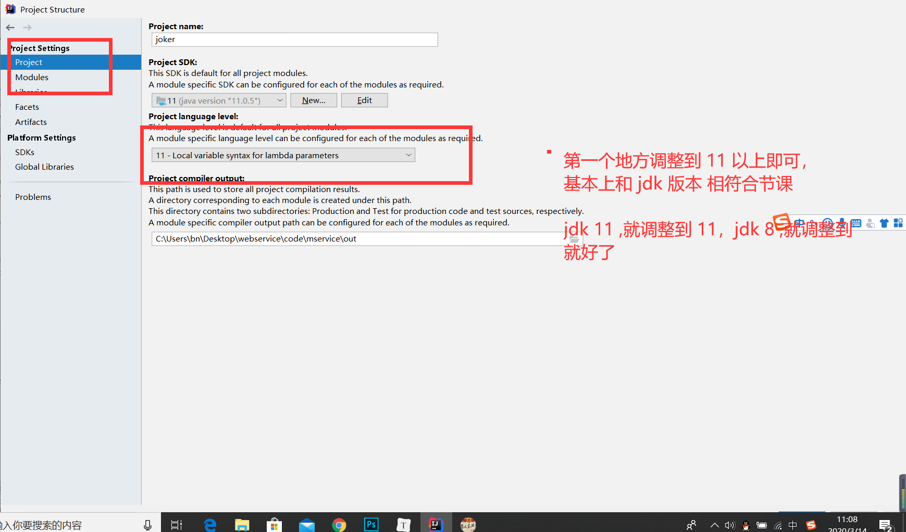


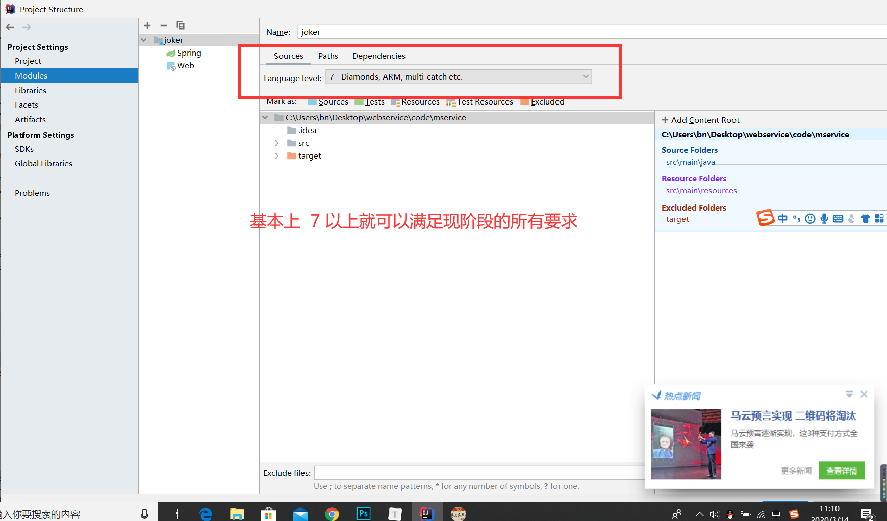


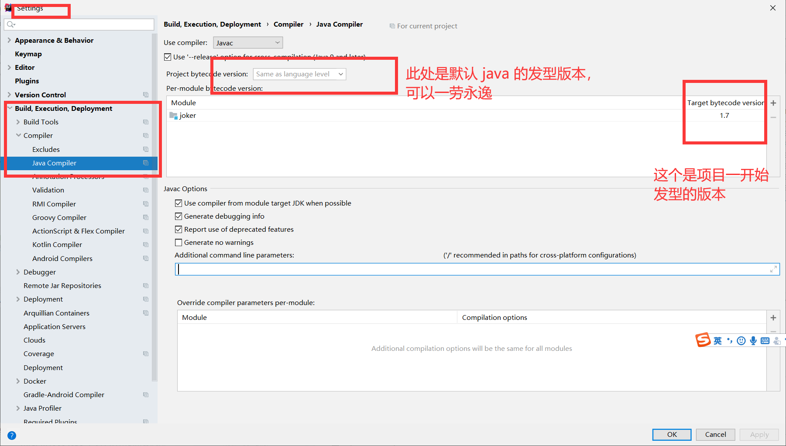

注意点就是  三个地方，调整的 版本基本上要一致


* 创建了新的 web 项目，不知如何运行


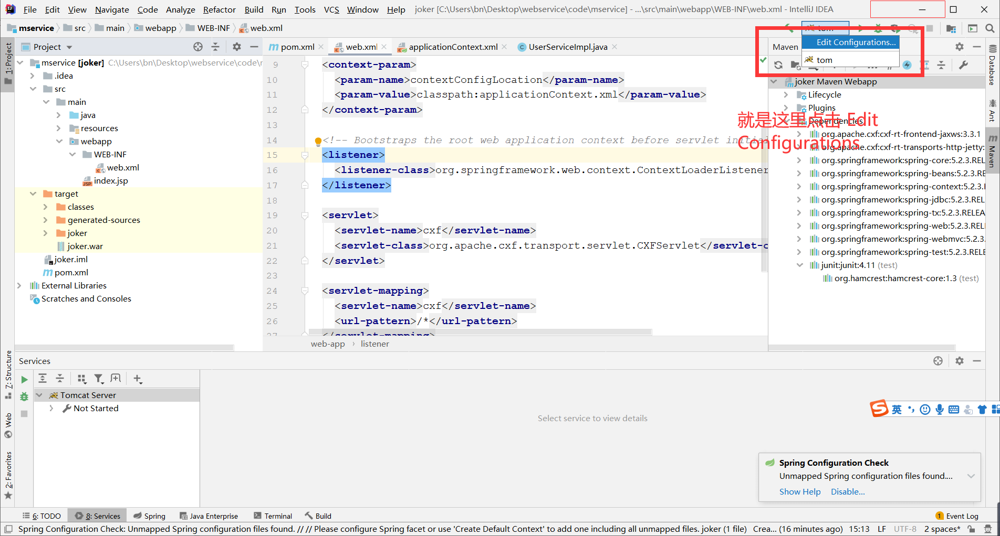


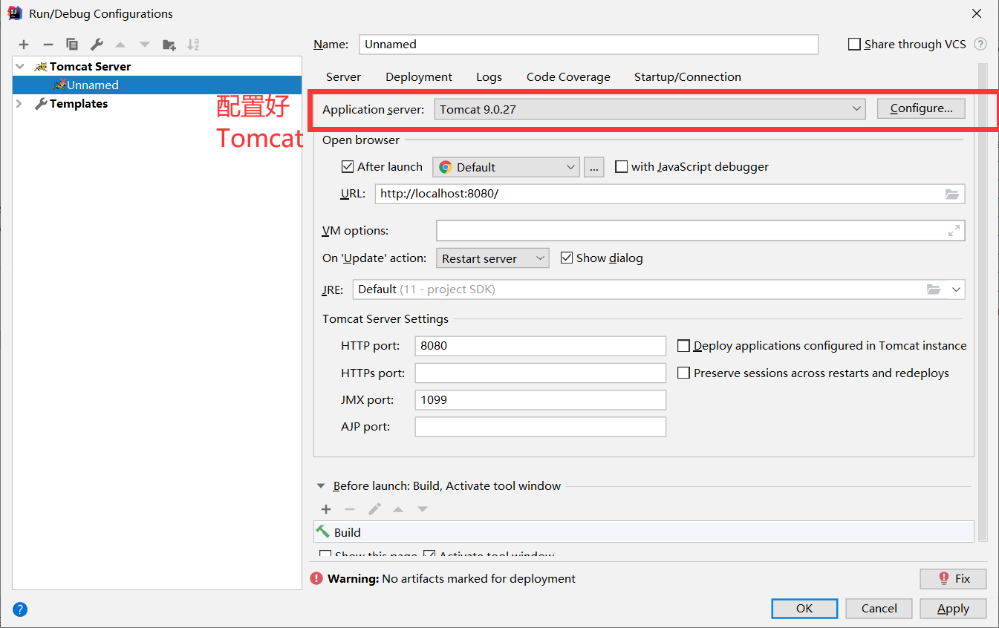


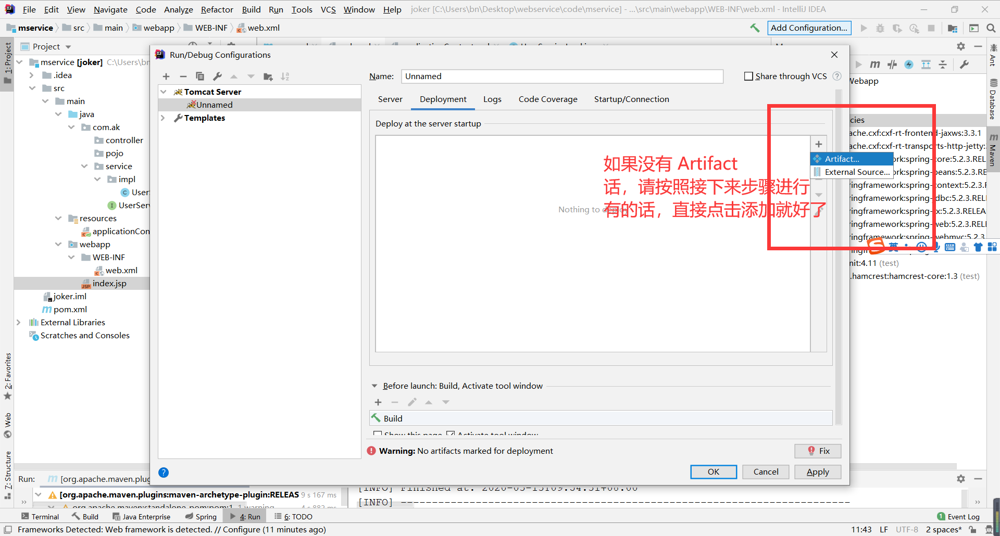


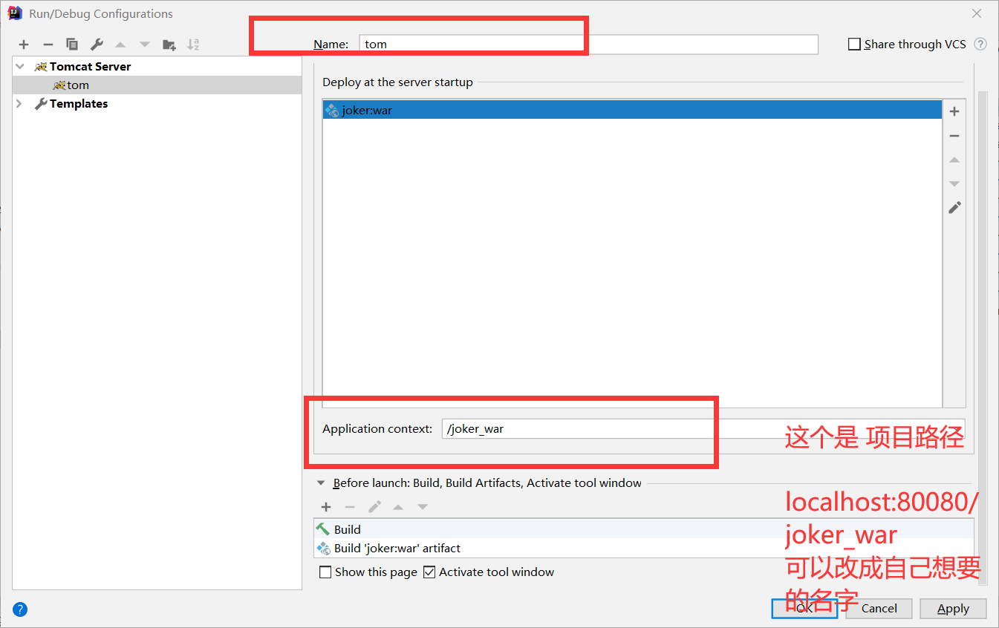


接下来是 没有 Artifact  的操作 ，如果 是直接 把项目拖入  项目中时，没有 jar 包怎么办？？？？？


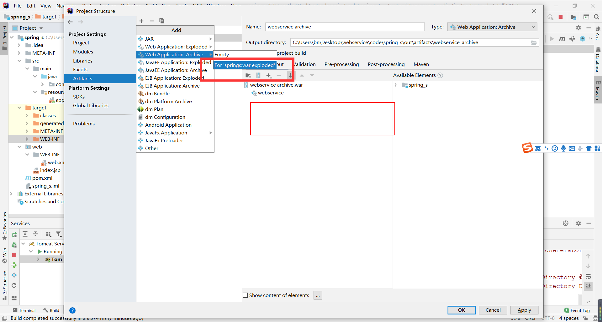

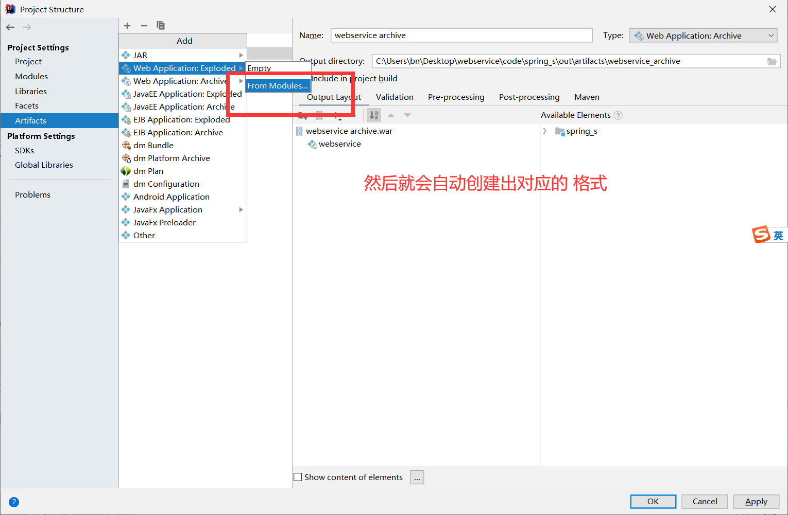

然后回去点击添加  jar 接口

下面是  输出格式的讲解

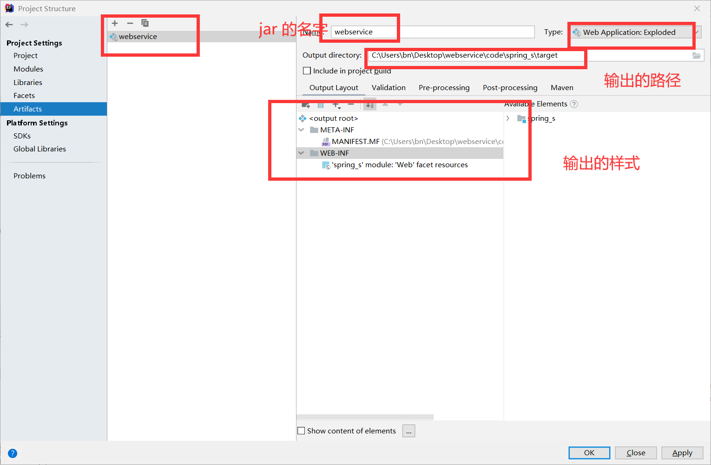


* 创建了一个 空白的 maven 项目，不知道如何 正确的 添加 web 项目 

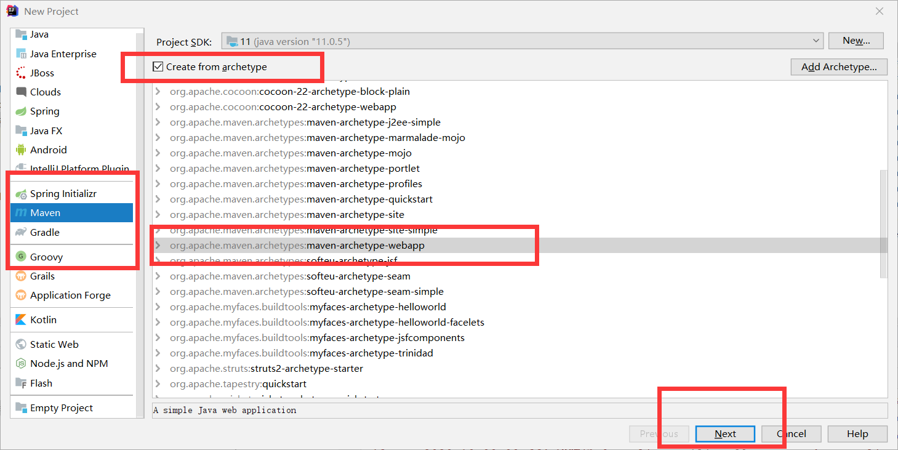


如果没有选择  maven 的模板 的话 ，就会出现的 空的 jar 项目，这样子的话 就得添加 Spring +Web 模板


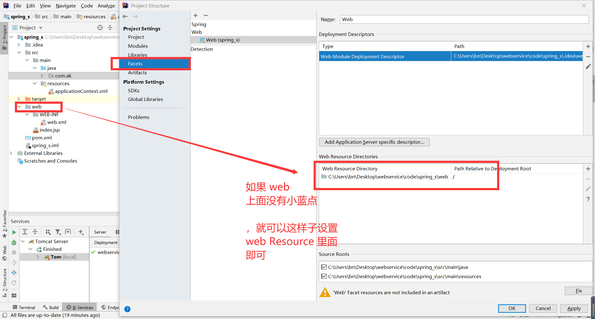


再次添加相应的 jar 包 


配置  Tomcat 即可使用 的